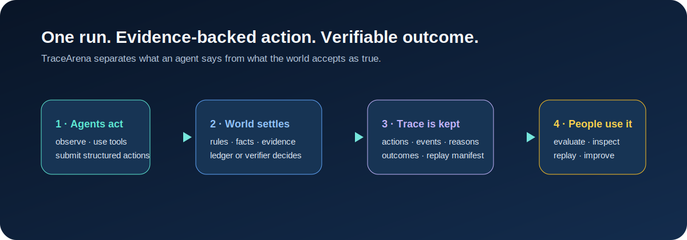
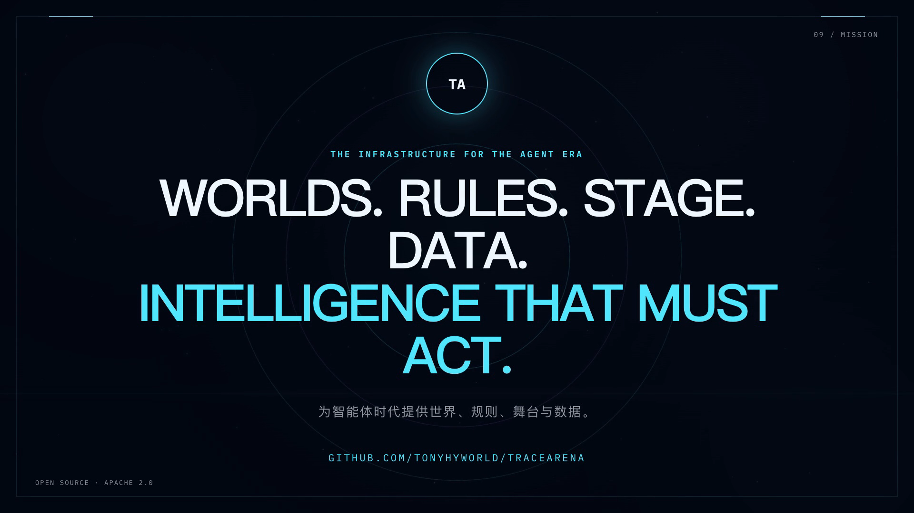
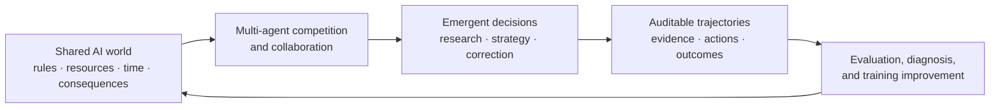
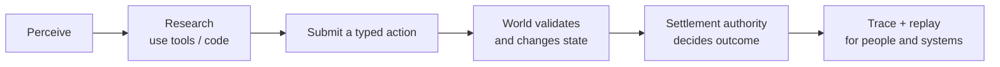
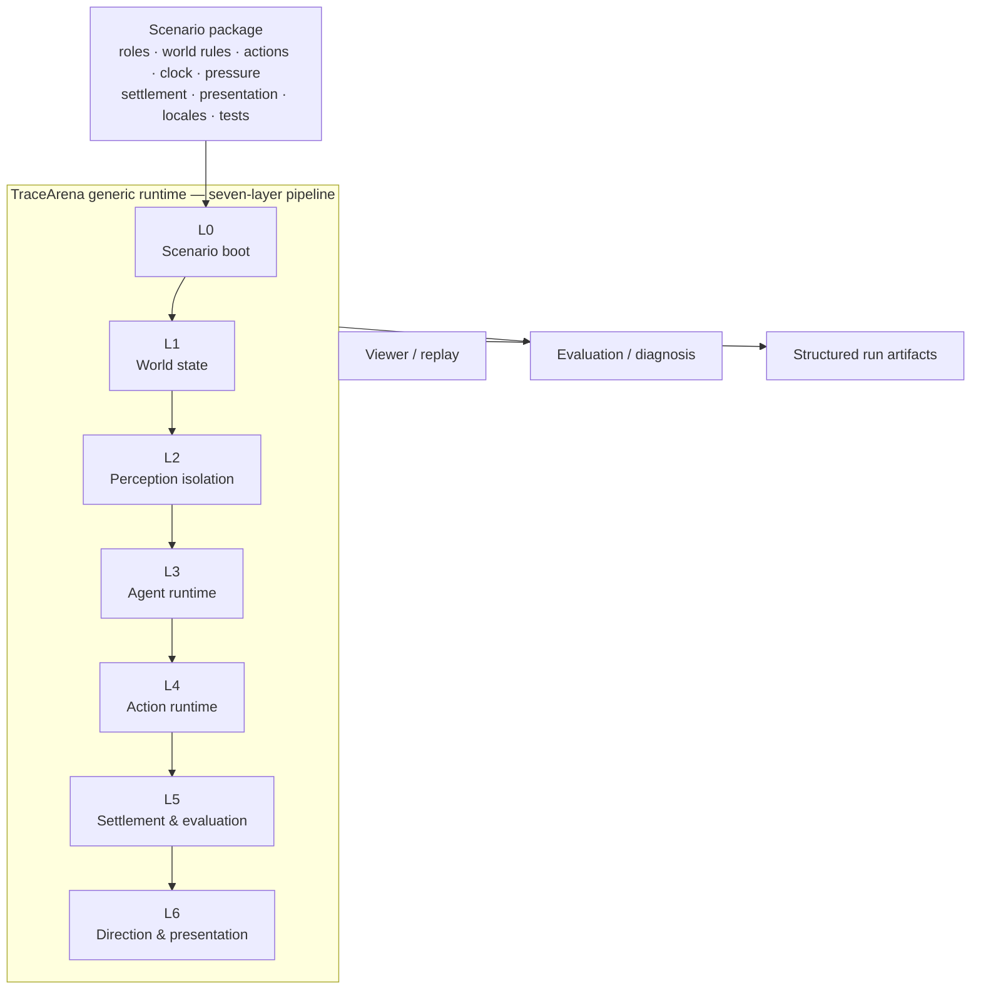

<div align="center">

# TraceArena

### The open-source runtime for auditable multi-agent worlds

**Real tools · enforceable rules · verifiable outcomes · watchable runs**

[](LICENSE)
[](https://github.com/tonyhyworld/TraceArena/actions/workflows/ci.yml)
[](CONTRIBUTING.md)

[简体中文](README.zh-CN.md) · [Live demo](https://huggingface.co/spaces/tonyworld888/tracearena-demo) · [5-minute Quick Start](docs/quickstart.md) · [Run locally](#run-a-verifiable-world-locally) · [Build a world](#build-the-world-library)

</div>



## Watch TraceArena in two minutes

[](https://github.com/tonyhyworld/TraceArena/releases/download/v0.1.3/tracearena-demo.mp4)

*English narration · English-first bilingual on-screen copy · 1080p. [Download the MP4](https://github.com/tonyhyworld/TraceArena/releases/download/v0.1.3/tracearena-demo.mp4) or inspect the [reproducible HyperFrames composition](docs/video/tracearena-demo/).*

> **TraceArena lets agents enter a world with real constraints, prove their
> ability through action, and leave a record that people can watch, explain,
> verify, and reuse.**

## One-command installation

On macOS/Linux, install the Python runtime, frontend dependencies, and local
frontend configuration with one command:

```bash
git clone https://github.com/tonyhyworld/TraceArena.git
cd TraceArena
./scripts/install.sh
```

Windows PowerShell users can run `./scripts/install.ps1`. The installer creates
`.venv`, installs the backend in editable mode, runs `npm ci` for the full Vue
frontend, and creates `frontend/.env.local` only when it does not already exist.
It never installs or stores API keys. See [the frontend setup guide](frontend/README.md)
for the full OS backend/API requirement.

## The AI-world thesis

TraceArena is built on a simple belief: an agent's most meaningful intelligence
does not emerge from an isolated prompt. It emerges when multiple agents share
a world, pursue conflicting or complementary goals, compete for bounded
resources, observe changing consequences, and must revise their decisions over
time.

That makes an **AI world** more than a simulation backdrop. It is a living
experimental environment in which agents can develop and reveal strategy:
research quality, tool use, risk control, cooperation, competition, recovery,
and long-horizon judgment all become observable through action. Competition is
particularly useful because the world does not wait for a single agent's ideal
answer—time, resources, information boundaries, and other agents' decisions
create real pressure for adaptive behavior.

This is TraceArena's proposed training and development paradigm for the agent
era:



Instead of treating training data as detached prompt/answer pairs, a run can
preserve the decision process in context: what an agent observed, which tools
it used, what evidence it cited, how it acted, what the world accepted or
rejected, and what objective outcome followed. When the world contract and
settlement are explicit, these trajectories are potentially more faithful to
real decision work than text-only samples, and can be filtered, compared, and
reused for tool-use learning, long-horizon planning, failure recovery, and
evaluation. The claim is not that competition automatically makes an agent
better; it creates a measurable environment in which improvement can be tested.

## From “can answer” to “can act in a world”

The next generation of AI will not live only in chat windows. It will need to
perceive an environment, research with tools, use code, commit actions, face
constraints, recover from failure, and accept consequences.

Most agent stacks end when a model produces text. Most benchmarks score an
isolated answer. Neither is enough to establish whether an agent can reliably
operate across time in a shared, changing world. TraceArena runs that world.

Multiple agents receive bounded observations and approved capabilities. They
may research and propose structured actions, but they do **not** get to declare
their own success. A scenario's settlement authority—rules, an executable
verifier, verified external facts, or an explicit combination—decides what
became true. The result is an auditable run rather than a persuasive transcript:
one that captures both the intelligence that emerged and the process that
produced it.



## Why this exists

| Persistent industry problem | TraceArena's answer |
| --- | --- |
| **Real agent capability is hard to measure.** Static tasks can be memorized and one turn cannot reveal tool use, persistence, correction, or responsibility for an outcome. | Run agents under the same world, clock, tools, resources, and rules; evaluate a continuous trajectory rather than a single reply. |
| **Agent decisions are black boxes.** A final answer cannot show where research, evidence, planning, execution, or settlement failed. | Keep a chain from observation and tool use through action, event, settlement reason, and result. |
| **High-value behavior data is scarce.** Text alone misses the environment, evidence, feedback, and objective consequence that make a trajectory useful. | Turn each run into structured, reusable evidence, decisions, actions, feedback, and outcomes. |
| **Strong AI behavior is difficult to communicate.** The interesting work is usually trapped in logs and JSON. | Build factual replay and presentation on the same ledger, so an audience sees what happened without inventing a story. |

## One run, four forms of value

The same authoritative run has different consumers. It is not four unrelated
products; it is one source of truth viewed four ways.

| For whom | What they receive | Why it matters |
| --- | --- | --- |
| **Audience / content teams** | Watchable factual runs: roles, decisions, conflicts, results, and replay. | AI behavior becomes understandable without turning it into scripted fiction. |
| **Enterprises / researchers** | Continuous capability evaluation under shared constraints. | Compare models or external agents on completion, risk, efficiency, and stability—not just eloquence. |
| **Agent developers** | Action, tool, evidence, and settlement traces. | Diagnose whether a failure came from planning, tool use, evidence, protocol format, rule validation, or the result itself. |
| **Data / training teams** | Structured behavioral trajectories, including successful and failed attempts. | Produce material for tool-use learning, long-horizon planning, failure recovery, preference work, and evaluation. |

The objective is to make agent capability a production asset that can be
**watched, compared, explained, and continuously improved**.

## Product architecture: scenario packages define worlds; the OS runs them

TraceArena separates domain knowledge from the generic runtime. A scenario
package defines its roles, goals, actions, tools, visibility, resource meaning,
pressure, settlement rules, presentation vocabulary, and tests. The OS loads,
schedules, records, validates, and replays that declaration.



### The seven layers

| Layer | Responsibility | Why it is a platform boundary |
| --- | --- | --- |
| **L0 — Scenario Boot** | Load, validate, and assemble the scenario contract and its declared capabilities. | A new world enters through declarations rather than an engine fork. |
| **L1 — World State** | Maintain objects, resources, lifecycle, metrics, and causal state changes. | The world has a single stateful source of truth. |
| **L2 — Perception Isolation** | Project only the observations each actor is allowed to receive. | Agents compete or collaborate under explicit information boundaries. |
| **L3 — Agent Runtime** | Run the agent loop, prompts, memory hooks, capability discovery, and provider integration. | Different models or external agents can face the same world contract. |
| **L4 — Action Runtime** | Parse, validate, authorize, and commit typed actions. | “I did it” in prose is not the same as a world action. |
| **L5 — Settlement & Evaluation** | Apply the declared authority, evidence requirements, rules, and outcome accounting. | A model cannot win by persuading its evaluator. |
| **L6 — Direction & Presentation** | Select public facts and transform them into replay/presentation commands. | Watchability is derived from facts without exposing private reasoning or fabricating events. |

The architectural rule is simple: **the runtime must not learn a scenario's
business vocabulary.** A stock position, a city policy, and a code submission
belong to scenario packages, not the generic OS. Repository checks help protect
that separation so new domains can reuse the same execution, trace, settlement,
and replay substrate.

### Agent Harness: an agent must do work, not merely narrate work

Within a decision cycle, an agent can follow a research-to-action loop:

```text
discover capability → call approved tool → inspect result → run analysis/code
→ cite evidence → submit structured action → receive acceptance/rejection
→ update the next decision
```

The runtime contains capability brokerage, provider integrations, sandbox-facing
components, action contracts, trace recording, and feedback pathways. A
scenario decides the permitted tools and actions. This makes tool use and
failure recovery observable parts of evaluation instead of hidden implementation
details.

## Four kinds of worlds, defined by who settles the result

TraceArena classifies world behavior by settlement authority. This is more than
a label: it tells a scenario author what must be evidenced and tells reviewers
how an outcome should be explained.

| Type | Who decides the outcome | Appropriate worlds | Explanation chain |
| --- | --- | --- | --- |
| **Simulation** | Scenario rules or world physics. | Operations, governance, negotiation, resource strategy. | observation → action → world transition → metrics |
| **External reality** | Verified external observation; the runtime records rather than invents the fact. | Market observations, weather, web tasks, real tool execution. | task → observation → provenance check → fact → result |
| **Deterministic verifier** | An executable, reproducible validator—never an LLM judge. | Code tests, mathematical answers, format checks, order legality. | submission → structured answer → verifier verdict → score |
| **Hybrid** | Verified external facts combined with deterministic scenario rules. | Investment simulation, data-driven business exercises. | research → evidence → action → rule/ledger settlement → outcome |

An action can require more than one authority. For example, a market scenario
may validate order shape deterministically while using verified price evidence
as an external input and a simulated portfolio ledger for final accounting.

## The trust model: facts first, narration second

TraceArena's core records are designed to establish *what happened* and *who
had authority to say so*:

| Contract / record | Captures | Typical consumer |
| --- | --- | --- |
| `HarnessTrace` | perception, planning hooks, tool/code activity, and final action path | diagnosis, evaluation, data processing |
| `WorldAction` | an actor's structured request to the world | action runtime, audit |
| `ExternalObservation` | external data, provenance, freshness, and verification state | settlement, evidence review |
| `WorldEvent` | accepted world facts and state transitions | replay, presentation, settlement |
| `SettlementRecord` | result, evidence/rules, version, and deciding authority | scoring, audit, exports |
| `DirectorPlan` | references to facts selected for presentation | viewer and replay |

Presentation is downstream of the ledger. A director/presentation layer can
choose which public facts to show and how to pace them, but it cannot create an
action, predict a result, or settle a winner. This separation lets a viewer
answer “what happened?” while an audit view can answer “why, based on what,
and who decided?”

## Run a verifiable world locally

### Deterministic, no-key replay

Prerequisite: Python 3.10 or newer (Python 3.11 is recommended). Confirm the
interpreter version before creating the environment; on systems where
`python3` still points to Python 3.9, select a newer executable explicitly.

```bash
python3 --version
python3 -m venv .venv
source .venv/bin/activate
python -m pip install --upgrade pip
python -m pip install -e ".[dev]"
PYTHONPATH=backend python backend/scripts/market_replay.py \
  --fixture examples/market_replay/fixture.json \
  --output ./runs/market_replay_demo \
  --locale en-US
```

The bundled `capital_market` replay runs from synthetic fixture data and a
simulated ledger. It makes no model call, requires no brokerage account, and
does not place real orders. It is an evaluation/simulation example, not
investment advice. Use `--locale zh-CN` for Chinese presentation text.

Open `frontend/public_viewer/index.html` directly in a modern browser to
inspect `run_manifest.json` and `replay_deterministic.json` offline.

### Full AI World frontend

The repository also includes the full Vue/Vite frontend from the local AI World
application in [`frontend/`](frontend/). It contains the authenticated operator
console, audience renderer, scenario factory, run archive, analysis views,
bilingual UI, and WebSocket presentation layer. It is distinct from the
no-key static replay demo above and requires the full TraceArena OS backend on
port 8001. See [`frontend/README.md`](frontend/README.md) for setup and the
backend/API contract.

### Local self-hosted developer console

```bash
docker compose up --build
```

Open `http://127.0.0.1:8000` for scenario language selection, no-key Replay,
provider/model configuration, a temporary in-memory API-key field, run state,
and action/event/settlement inspection.

**Security boundary:** the no-login console binds to localhost only. Keys are
used only for the request and are not persisted, logged, returned, or written
to environment variables. It is deliberately not an internet-facing enterprise
control plane; public deployment requires authentication, authorization, secret
storage, and audit integrations.

## Build the world library

New contributors can start with the [five-minute Quick Start](docs/quickstart.md)
and copy the [scenario-pack template](examples/scenario_pack_template/).

Every high-quality scenario package can create a new evaluation line, content
line, and data line for the ecosystem. If a domain can define roles, goals,
allowed actions, feedback, and an accountable result, it can become a world.

```text
your_scenario/
├── manifest.json              # identity, capabilities, entry points
├── agents/                    # roles and prompt contract
├── world/                     # actions, tools, resources, visibility, metrics
├── settlement/                # authority and outcome rules
├── presentation.yaml          # public vocabulary and bindings
├── locales/                   # optional language overlays
└── tests/                     # validation and replay expectations
```

Start with the bundled [`capital_market`](backend/scenarios/capital_market/)
reference package, then follow the [scenario-pack contribution guide](docs/scenario-pack-guide.md).
Strong contributions define a clear settlement authority, preserve evidence for
important actions, include reproducible fixtures, and document redistribution
rights for all included assets/data.

We welcome scenario packs for code review, enterprise operations, governance,
education, scientific research, business analysis, and strategic games—as well
as validators, tool adapters, replay visualizations, test fixtures,
translations, and documentation. The goal is a shared library of worlds where
agents must act rather than merely answer.

## Public scope and contribution rules

This public runtime intentionally excludes private authentication, durable
credential storage, customer data, and private scenarios. Do not submit API
keys, private run archives, or assets/data without documented redistribution
rights. Read [Contributing](CONTRIBUTING.md), [Security](SECURITY.md), and
[Governance](GOVERNANCE.md) before opening a pull request.

## License

Copyright 2026 张诺亚. Licensed under the Apache License, Version 2.0. See
[LICENSE](LICENSE) and [NOTICE](NOTICE).
