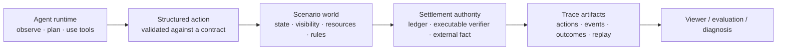

<div align="center">

# TraceArena

**The open-source runtime for auditable multi-agent worlds — real tools, verifiable outcomes, watchable runs.**

[](LICENSE)
[](https://github.com/tonyhyworld/TraceArena/actions/workflows/ci.yml)
[](CONTRIBUTING.md)

[简体中文](README.zh-CN.md) · [Quick start](#run-a-verifiable-world-locally) · [Build a scenario pack](#grow-the-world-library)

</div>


## AI agents should be judged by what happens, not by what they claim

Most agent stacks end when a model returns text. That is insufficient when an
agent must investigate, use a tool, spend a resource, make a structured move,
and live with the result. It also leaves teams unable to answer the practical
questions: *What evidence did it use? Which rule accepted or rejected it? Can
we replay the result?*

TraceArena is a runtime for persistent, shared worlds. Multiple agents receive
bounded observations, use approved capabilities, and submit typed actions. A
scenario's rules and settlement authority—not an LLM self-evaluation—determine
what becomes world fact. The run is retained as an inspectable trace.

| The problem | What TraceArena makes possible |
| --- | --- |
| A chat answer hides the work and cannot be independently checked. | Preserve the chain from observation and action to event, settlement, and outcome. |
| Static benchmarks reward memorisation and one-shot answers. | Evaluate continuous choices under the same clock, rules, resources, and pressure. |
| Domain logic gets welded into every agent application. | Express a world as a scenario package while keeping the runtime generic. |
| Impressive demos are hard to trust or explain. | Produce replay artifacts that a reviewer can inspect offline. |

This creates value for four audiences: researchers comparing agents, product
teams diagnosing tool-using behaviour, operators reviewing consequential runs,
and world builders who need a reusable execution and settlement substrate.

## The product in one picture



The important separation is deliberate: the agent may propose; the world
decides. Scenario packages declare the vocabulary and rules of a world. The
generic runtime runs the lifecycle, records the trace, and exports replayable
artifacts.

## What is in this repository

- **Scenario Boot and contracts** — load a scenario's roles, actions, tools,
  visibility, resources, metrics, presentation, and settlement configuration.
- **Tick-based multi-agent runtime** — progress a shared world through
  observation, action validation, event generation, and authoritative
  settlement.
- **Trace and deterministic replay** — record run manifests and replay data so
  behavior can be inspected after the run, including offline in the Viewer.
- **Scenario/runtime boundary checks** — validation and purity checks help keep
  domain rules out of the generic OS layer.
- **A runnable capital-market example** — synthetic fixture data and a
  simulated ledger make the bundled replay reproducible without a model key,
  brokerage account, or real order execution.
- **A local self-hosted console** — start a trusted-localhost developer
  console for replay, temporary model configuration, run status, and artifact
  inspection.

The capital-market package demonstrates a **hybrid** world: observed market
data can inform an agent while the scenario's simulated ledger settles the
portfolio. It is infrastructure for simulation and evaluation, not investment
advice and not a live-trading system.

## Run a verifiable world locally

### No-key deterministic replay

```bash
python -m venv .venv
source .venv/bin/activate
python -m pip install -e ".[dev]"
PYTHONPATH=backend python backend/scripts/market_replay.py \
  --fixture examples/market_replay/fixture.json \
  --output ./runs/market_replay_demo \
  --locale en-US
```

The output contains a run manifest and deterministic replay. Use `--locale
zh-CN` for Chinese presentation text. Open
`frontend/public_viewer/index.html` in a modern browser to inspect the
artifacts locally; the Viewer has no login, backend, or model integration.

### Local developer console

```bash
docker compose up --build
```

Open `http://127.0.0.1:8000`. The console supports scenario language choice,
no-key Replay, provider/model configuration, a temporary in-memory API-key
field, run state, and action/event/settlement inspection.

**Security boundary:** this no-login console binds to localhost only. A key is
used only for the current request; it is not persisted, logged, returned, or
written to environment variables. It is not a public-internet operations
console. Internet-facing deployment requires authentication, authorization,
secret storage, and audit integrations.

## Grow the world library

TraceArena becomes more useful as its library of worlds grows. The best way to
contribute is to build a scenario pack that makes agents face a meaningful,
testable constraint—not merely answer a prompt.

```text
your_scenario/
├── manifest.json              # identity, capability contract, entry points
├── agents/                    # roles and prompt contract
├── world/                     # actions, tools, resources, visibility, metrics
├── settlement/                # authority and outcome rules
├── presentation.yaml          # display vocabulary and bindings
├── locales/                   # optional language overlays
└── tests/                     # validation and replay expectations
```

Good packs have a clear settlement authority: a deterministic verifier,
scenario physics, verifiable external facts, or an explicit hybrid of these.
They declare what an agent may observe and do, define what constitutes an
accepted result, and ship a reproducible test/replay fixture. Start from the
bundled [`capital_market`](backend/scenarios/capital_market/) pack and read the
[scenario-pack contribution guide](docs/scenario-pack-guide.md).

We welcome packs for code review, operations, governance, education, research,
or any other domain where continuous agent action should have accountable
consequences. Contributions of validators, replay visualizations, tool
adapters, tests, translations, and documentation are equally valuable.

## Project boundaries and contribution rules

The public runtime excludes private authentication, user management, durable
credential storage, customer data, and private scenarios. Do not submit API
keys, private run archives, or media/data without documented redistribution
rights. See [Contributing](CONTRIBUTING.md), [Security](SECURITY.md), and
[Governance](GOVERNANCE.md) before opening a pull request.

## License

Copyright 2026 张诺亚. Licensed under the Apache License, Version 2.0. See
[LICENSE](LICENSE) and [NOTICE](NOTICE).
