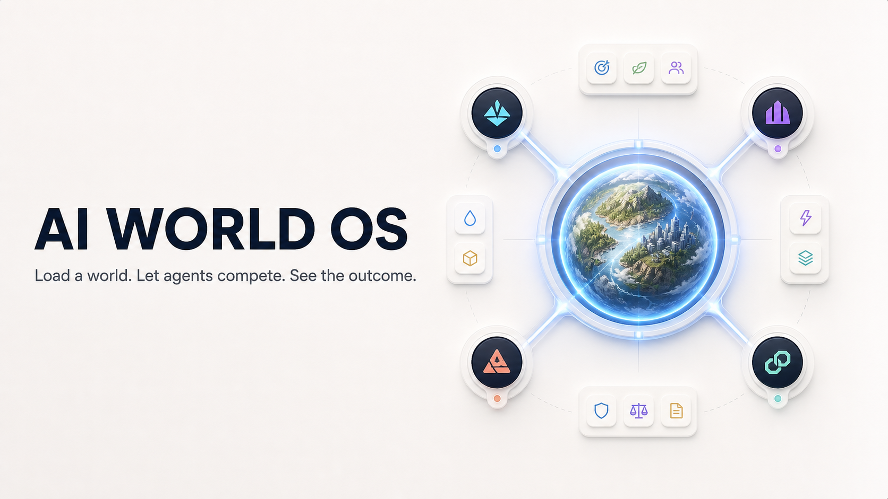
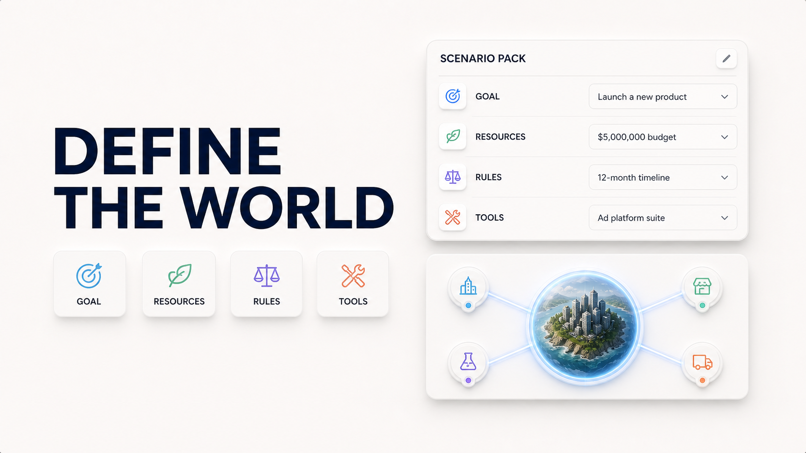
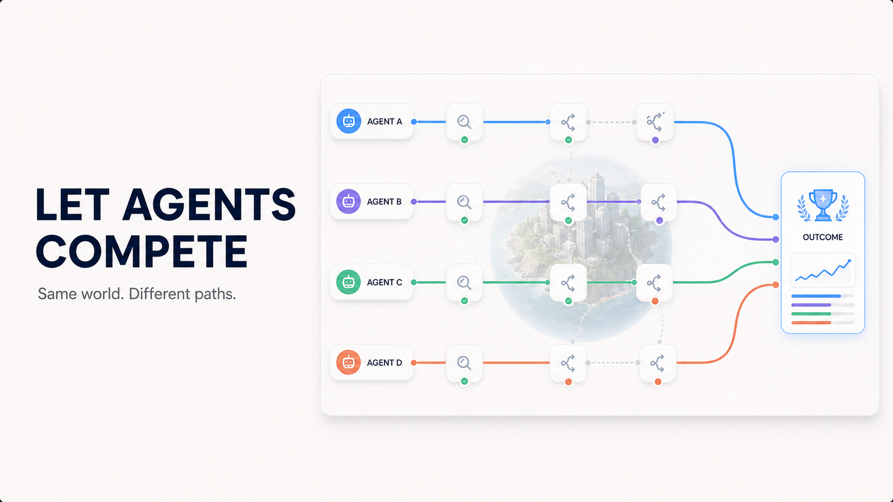
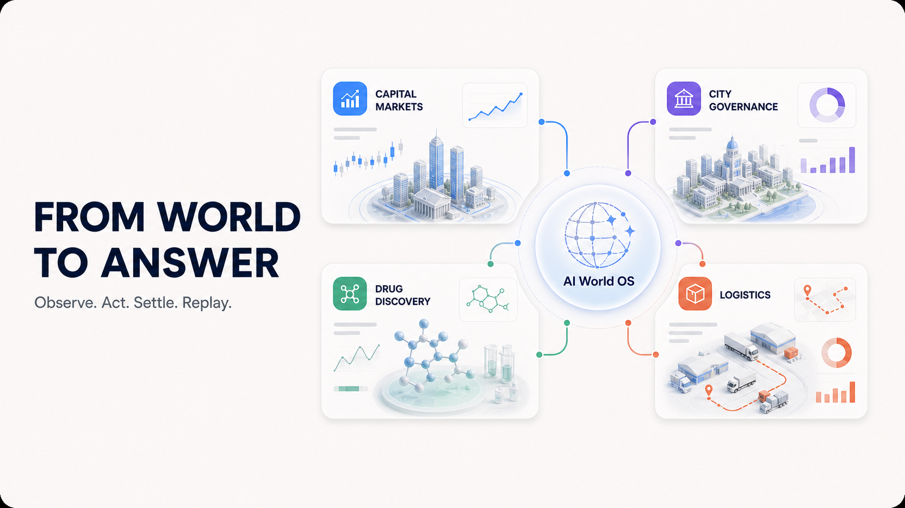
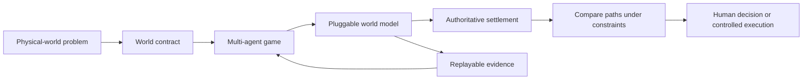
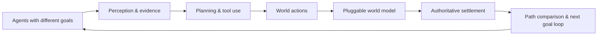

# TraceArena

[](https://github.com/tonyhyworld/TraceArena/releases/latest)
[](https://tonyworld888-tracearena-demo.static.hf.space/index.html)
[](LICENSE)


### See the AI World OS



Define the world, let agents compete inside the same constraints, and inspect the result:

| Define | Compete | Apply across domains |
| --- | --- | --- |
|  |  |  |

**The open-source AI World OS that lets domain experts turn professional problems into runnable multi-agent worlds.**

TraceArena gives domain experts a reusable AI problem-solving framework: define the **goal, resources, constraints, tools, success criteria and how the world responds**, then let multiple Agents compete inside that AI World to achieve the goal. Capital-market validation, city governance, drug discovery, logistics, operations or a problem only you understand can become scenario packs instead of one-off demos. The system runs the process, compares paths and makes every decision visible from evidence to action to outcome.

The feedback mechanism does not have to be a complete physical twin. A scenario can use **expert rules, deterministic algorithms, a trained World Agent, a professional simulator, a real system, or a traceable hybrid**. TraceArena connects all six through one World Adapter contract and records their provenance, assumptions, confidence, validation evidence and limits. Teams can start with a useful bounded model and increase fidelity over time.

### Load any world. Define the goal. Let Agents find the path.

The long-term vision is one OS in which anyone can load a different world—capital markets, city governance, pharmaceutical research, operations, logistics, robotics or a new domain—by declaring its scenario contract. The contract makes the problem executable:

| Physical-world element | Loaded into TraceArena as |
| --- | --- |
| resources and state | world objects, budgets, inventories and lifecycle state |
| goals and priorities | agent objectives and settlement metrics |
| rules and constraints | validators, permissions, clocks and failure conditions |
| tools and evidence | capability schemas, observations and provenance |
| world feedback | rules, algorithms, learned models, simulators, real systems or hybrids |
| consequences | authoritative events, settlement and resource updates |

TraceArena is not a chatbot wrapper that stops at an answer. It is an AI World OS: **you define what must be achieved, what the world permits and how feedback is produced; competing Agents search for paths; an independent settlement authority compares the outcomes**. The entire process can be watched and replayed—what each Agent saw, which tools it used, how it acted, what the world model returned, and why one path achieved the goal. “Best” always means best under the declared goal, resources, model assumptions and evidence, not a claim of universal optimality.

### Why multi-agent competition makes the world useful

A single Agent can describe a plausible plan. In an AI World, several Agents face the same world while pursuing the defined goal through different strategies, information and risk limits. Their paths compete through a shared clock, finite resources and world feedback. The world rejects invalid actions, applies consequences and settles outcomes, so a persuasive answer cannot win by rhetoric alone.



The result is a new agent-development paradigm: lower the barrier from “how do I make an AI solve this operational problem?” to “how do I declare the world's resources, goals, rules and outcomes?” Then let agents iterate toward a goal through a continuous **perceive → deliberate → act → receive feedback → revise** loop, with checkpoints and permission boundaries.

### Six world-model implementations, four settlement authorities

The World Adapter execution layer supports `rule_based`, `algorithmic`, `learned`, `simulator`, `reality`, and `hybrid`. This axis answers **how the world changes**. TraceArena's four settlement types—`simulation`, `external_reality`, `deterministic_verifier`, and `hybrid`—answer **who is authorized to prove the result**. Keeping these axes separate lets a learned World Agent help model consequences without pretending its prediction is a physical fact or automatically making it the winner judge.

See the [World Model / Adapter SDK](docs/WORLD_ADAPTER_SDK.md) and the [authoritative product positioning](docs/PRODUCT_POSITIONING.md).

> **Positioning update (July 2026):** Read the [community announcement](https://github.com/tonyhyworld/TraceArena/discussions/12) for the new Physical World OS direction and the next scenarios we want the ecosystem to load.

### Choose your path

| If you want to… | Start here |
| --- | --- |
| See a world run without installing anything | [Open the live Demo](https://tonyworld888-tracearena-demo.static.hf.space/index.html) |
| Run a deterministic replay locally | [Follow the five-minute Quickstart](docs/quickstart.md) |
| Build a new agent world | [Propose a scenario pack](https://github.com/tonyhyworld/TraceArena/issues/2) |
| Load a private AI World with your team | [Start an AI World Pilot](.github/ISSUE_TEMPLATE/agent-evaluation-pilot.yml) |

Each path has one next action. You do not need an API key for the public replay.

> **For teams:** load one bounded real-world problem as a private AI World, define its goal, resources and rules, let 2–4 agent/model configurations compete, and receive a reviewable path and outcome report. Pilot engagements start at RMB 29,800; see the [AI World Pilot one-pager](docs/open_source_release/PILOT_ONE_PAGER.md) or [start a pilot](.github/ISSUE_TEMPLATE/agent-evaluation-pilot.yml).



## What it provides

```text
perception → planning → evidence → tools/code → action
           → world-model feedback → settlement → result → replay
```

- declarative world contracts for resources, goals, rules, roles, actions, tools, visibility and settlement;
- a multi-agent tick pipeline with observations, actions, events and authoritative outcomes;
- structured comparison of alternative paths under the same world constraints;
- deterministic replay and evidence-linked traces;
- validation and purity tools for keeping domain rules out of the generic runtime;
- a no-key synthetic Market Replay example for local evaluation.
- a no-key synthetic Incident Response World showing a non-financial evidence → action → settlement loop.

### Seven-layer runtime pipeline

The generic OS keeps orchestration and evidence concerns stable while scenario packs own domain rules:

1. **World clock** — deterministic ticks and phase transitions.
2. **Observation** — scoped facts, events and external evidence.
3. **Agent runtime** — goals, memory, prompts and model adapters.
4. **Capability/tool broker** — explicit permissions, schemas and provenance.
5. **Action pipeline** — validated, structured actions instead of free-form side effects.
6. **Settlement** — authoritative outcomes, resources, scores and failure reasons.
7. **Trace/presentation** — audit records, replay, metrics and watchable views.

### Four scenario types, one extensible ecosystem

Scenario packs declare who can settle the result and how evidence is treated:

| Type | Typical use | Why it matters |
| --- | --- | --- |
| Simulated world | strategy, negotiation, games | safe iteration with explicit rules |
| External reality | market, operations, live data | decisions meet real observations |
| Deterministic verification | coding, planning, benchmarks | repeatable pass/fail evaluation |
| Hybrid world | research and enterprise pilots | controlled simulation plus real evidence |

The OS does not hard-code a domain. A contributor can add a new world by shipping a scenario pack—agents, world contract, tools, settlement, rendering and tests—without changing the runtime core.

## Quickstart

The public preview includes a deterministic, no-key Market Replay that can be run locally in minutes. The [`capital_market` Public Edition](backend/scenarios/capital_market/) also documents the optional BYO-model/read-only-research path; it always settles against a simulated ledger and never connects to a brokerage or submits real orders:

[](https://codespaces.new/tonyhyworld/TraceArena?quickstart=1)

If you prefer not to configure Python and Node locally, open the repository in
GitHub Codespaces. The checked-in dev container installs the development
dependencies and forwards the public frontend/backend ports. Codespaces usage
is subject to GitHub account quotas and billing; the no-key replay itself stays
local and free of model or brokerage credentials.

```bash
./scripts/install.sh
# The installer creates/reuses .venv and runs npm ci for the frontend.
# Windows PowerShell: .\scripts\install.ps1
# If python3 is not the right interpreter: PYTHON_BIN=/path/to/python3.12 ./scripts/install.sh

# Then run the no-key replay:
source .venv/bin/activate
PYTHONPATH=backend python backend/scripts/market_replay.py \
  --fixture examples/market_replay/fixture.json \
  --output ./runs/market_replay_demo
```

If you prefer to control each environment manually:

```bash
python -m venv .venv
source .venv/bin/activate
python -m pip install -e ".[dev]"
PYTHONPATH=backend python backend/scripts/market_replay.py \
  --fixture examples/market_replay/fixture.json \
  --output ./runs/market_replay_demo
```

See the full [Quickstart guide](docs/quickstart.md) for determinism checks,
scenario-pack development, and provider configuration. For a private server or
enterprise deployment, follow the [private deployment and first-login manual](docs/私有部署与首次登录手册.md)
before opening the frontend: the complete runtime requires an administrator
account and persistent user data.

Prefer a guided first look? Open the [live demo](https://tonyworld888-tracearena-demo.static.hf.space/index.html), read the [first public replay](https://github.com/tonyhyworld/TraceArena/discussions/4), or inspect [Run of the Week #2](https://github.com/tonyhyworld/TraceArena/discussions/11).

Looking for a non-financial example? Read the [Incident Response World](examples/incident_response_world/README.md), run its deterministic fixture, and inspect the explicitly rejected premature resolution.

Researchers can use the accompanying [Incident Response Benchmark Card](docs/benchmarks/incident-response-v0.md) to cite the evaluation question, metrics, settlement authority, and current limitations.

Want to inspect the evidence before installing? Download the [v0.1.6 replay
bundle](https://github.com/tonyhyworld/TraceArena/releases/download/v0.1.6/tracearena-v0.1.6-replay.zip)
and open its `summary.md`, `run_manifest.json`, and `replay_deterministic.json`.

For the latest non-financial benchmark, download the [v0.1.7 Incident Response
bundle](https://github.com/tonyhyworld/TraceArena/releases/download/v0.1.7/tracearena-v0.1.7-incident-response.zip)
or read the [v0.1.7 release notes](https://github.com/tonyhyworld/TraceArena/releases/tag/v0.1.7).

After your first run, please submit the short [first-run feedback form](https://github.com/tonyhyworld/TraceArena/issues/new?template=first-run-feedback.yml). It asks only about your path, result, environment, time to first result, and the next change that would make you continue—never include credentials or private run data.

Join the [technical discussion](https://github.com/tonyhyworld/TraceArena/discussions/3) to compare observations with other Agent builders.

The example uses a scripted replay provider, synthetic fixture data, no API key, no LLM call, no MCP call, no brokerage account and no real order execution. It is infrastructure for simulation and evaluation, not financial advice.

### Run the full AI World frontend locally

The replay above is the fastest public proof. To open the full watchable viewer
and operator console, run the backend and Vue frontend as two local processes.
This path uses the public capital-market scenario contract; it does not enable
the private 三子夺嫡 pack.

```bash
# Terminal 1 — backend
cd backend
source ../.venv/bin/activate
# Copy .env.example to .env and set AIWORLD_JWT_SECRET (32+ random characters)
# plus AIWORLD_SECRET_KEY (a Fernet key) before using local authentication.
AIWORLD_CONFIG=./framework.public.yaml PYTHONPATH=. \
  python -m uvicorn app.main:app --host 127.0.0.1 --port 8001

# Terminal 2 — create a local account once, then start the frontend
cd backend
source ../.venv/bin/activate
python scripts/create_user.py

cd ../frontend
npm run dev
```

Open `http://localhost:5173`. The account is stored only in local
`backend/user_data/`; there is no hosted account service in this public
candidate. A live agent run additionally requires configuring your own model
provider and any permitted tools. Start with the no-key replay before adding
credentials, and never commit `.env`, provider keys, customer data or private
run archives.

### Hugging Face models

TraceArena can route chat-completion agents through Hugging Face Inference
Providers using the existing OpenAI-compatible adapter. Set `HF_TOKEN`, choose
`provider: huggingface`, and use a Hugging Face model repository ID (for
example, `deepseek-ai/DeepSeek-R1:fastest`) in the agent configuration. The
default endpoint is `https://router.huggingface.co/v1`; override it with
`HF_BASE_URL` when using a compatible gateway. This path is optional and is not
used by the no-key replay.

## Repository scope

The public repository includes local authentication, the viewer, and the operator evaluation console. It intentionally excludes credentials, customer data, private run archives, enterprise-only integrations, and private scenarios such as 三子夺嫡. The synthetic Market Replay and the `capital_market` Public Edition are separately reviewed, safe-by-default examples; users supply and govern any optional model or data-provider credentials locally.

## Status

TraceArena is a public preview: the no-key replay path is verified, while the runtime and scenario-pack APIs continue to evolve with community feedback. See the [latest release](https://github.com/tonyhyworld/TraceArena/releases/latest) and the [public candidate scope](docs/open_source_release/PUBLIC_CANDIDATE_SCOPE.md) for current boundaries and release evidence.

## Contributing and security

See [CONTRIBUTING.md](CONTRIBUTING.md) and [SECURITY.md](SECURITY.md). Please do not submit credentials, customer data, private run archives, or media without redistribution rights.

## Cite TraceArena

If TraceArena contributes to a paper, benchmark, or evaluation report, use the
machine-readable metadata in [`CITATION.cff`](CITATION.cff) or GitHub's **Cite
this repository** action.

## Join the ecosystem

- Build and propose a scenario pack using the [scenario-pack guide](docs/scenario-pack-guide.md).
- Choose a next domain from the [AI World roadmap](docs/open_source_release/WORLD_ROADMAP.md).
- Propose an open benchmark using the [benchmark proposal form](.github/ISSUE_TEMPLATE/benchmark-proposal.yml).
- Report a reproducible bug or request a feature through GitHub Issues.
- Tell us how the first run went through the [first-run feedback form](https://github.com/tonyhyworld/TraceArena/issues/new?template=first-run-feedback.yml).
- To load a bounded private AI World with your team, use the [AI World Pilot request form](.github/ISSUE_TEMPLATE/agent-evaluation-pilot.yml).
- For implementation, integration, or evaluation support, see the [commercial support path](docs/commercial-support.md).
- For a concrete 10-day pilot scope, deliverables, acceptance criteria, and starting price, see the [pilot one-pager](docs/open_source_release/PILOT_ONE_PAGER.md).
- For public benchmark and open-source sustainability paths, see the [funding research note](docs/open_source_release/FUNDING_PATHS.md).
- For a speaker, research, or media introduction, see the [founder profile](docs/FOUNDER_PROFILE.md).
- To discuss a design-partner pilot publicly, see the [design-partner call](https://github.com/tonyhyworld/TraceArena/issues/7).
- Maintainers can use the [adoption log template](docs/open_source_release/ADOPTION_LOG_TEMPLATE.md) to report aggregate, auditable adoption signals without collecting unnecessary personal data.

For the maintainer-facing first 14-day distribution loop, see the [Growth
Execution Board](docs/open_source_release/GROWTH_EXECUTION_BOARD.md). It keeps
the funnel focused on real runs, useful feedback, scenario contributions, and
qualified AI World pilots rather than vanity metrics.

## License

Copyright 2026 张诺亚. Licensed under the Apache License, Version 2.0. See [LICENSE](LICENSE).
