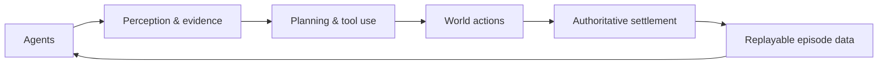

# TraceArena

[](https://github.com/tonyhyworld/TraceArena/releases/latest)
[](https://tonyworld888-tracearena-demo.static.hf.space/index.html)
[](LICENSE)


**The open-source runtime for auditable multi-agent worlds — real tools, verifiable outcomes, watchable runs.**

TraceArena is the open-source runtime behind **AI World**: a shared, constrained world where multiple agents act continuously, compete or cooperate, and leave a verifiable trail. Agents can use real tools, gather evidence, submit structured actions, receive world feedback, and live with the consequences. The world—not the model—decides what actually happened.

### The AI World idea

Most agent demos stop at a single response. AI World puts agents inside a world with shared rules, limited resources, competing objectives and authoritative settlement. Intelligence is allowed to **emerge through interaction**: agents perceive, research, decide, act, observe the consequences, and adapt while other agents are doing the same. The resulting decision process is more useful than a final answer alone because every claim, tool call, action and outcome can be inspected, replayed and compared.

This is a new agent-development and training paradigm: build environments that make agents live under constraints, then retain the resulting episodes as high-quality evaluation and training data. TraceArena makes that loop programmable, watchable and auditable.

### Choose your path

| If you want to… | Start here |
| --- | --- |
| See a world run without installing anything | [Open the live Demo](https://tonyworld888-tracearena-demo.static.hf.space/index.html) |
| Run a deterministic replay locally | [Follow the five-minute Quickstart](docs/quickstart.md) |
| Build a new agent world | [Propose a scenario pack](https://github.com/tonyhyworld/TraceArena/issues/2) |
| Evaluate a real workflow with your team | [Request an evaluation pilot](.github/ISSUE_TEMPLATE/agent-evaluation-pilot.yml) |

Each path has one next action. You do not need an API key for the public replay.



## What it provides

```text
perception → planning → evidence → tools/code → action
           → world facts → settlement → result → replay
```

- declarative scenario contracts for roles, actions, tools, visibility and settlement;
- a multi-agent tick pipeline with observations, actions, events and authoritative outcomes;
- deterministic replay and evidence-linked traces;
- validation and purity tools for keeping domain rules out of the generic runtime;
- a no-key synthetic Market Replay example for local evaluation.
- a no-key synthetic Incident Response World showing a non-financial evidence → action → settlement loop.

### Seven-layer runtime pipeline

The generic OS keeps orchestration and evidence concerns stable while scenario packs own domain rules:

1. **World clock** — deterministic ticks and phase transitions.
2. **Observation** — scoped facts, events and external evidence.
3. **Agent runtime** — goals, memory, prompts and model adapters.
4. **Capability/tool broker** — explicit permissions, schemas and provenance.
5. **Action pipeline** — validated, structured actions instead of free-form side effects.
6. **Settlement** — authoritative outcomes, resources, scores and failure reasons.
7. **Trace/presentation** — audit records, replay, metrics and watchable views.

### Four scenario types, one extensible ecosystem

Scenario packs declare who can settle the result and how evidence is treated:

| Type | Typical use | Why it matters |
| --- | --- | --- |
| Simulated world | strategy, negotiation, games | safe iteration with explicit rules |
| External reality | market, operations, live data | decisions meet real observations |
| Deterministic verification | coding, planning, benchmarks | repeatable pass/fail evaluation |
| Hybrid world | research and enterprise pilots | controlled simulation plus real evidence |

The OS does not hard-code a domain. A contributor can add a new world by shipping a scenario pack—agents, world contract, tools, settlement, rendering and tests—without changing the runtime core.

## Quickstart

The public preview includes a deterministic, no-key Market Replay that can be run locally in minutes:

[](https://codespaces.new/tonyhyworld/TraceArena?quickstart=1)

If you prefer not to configure Python and Node locally, open the repository in
GitHub Codespaces. The checked-in dev container installs the development
dependencies and forwards the public frontend/backend ports. Codespaces usage
is subject to GitHub account quotas and billing; the no-key replay itself stays
local and free of model or brokerage credentials.

```bash
./scripts/install.sh
# The installer creates/reuses .venv and runs npm ci for the frontend.
# Windows PowerShell: .\scripts\install.ps1
# If python3 is not the right interpreter: PYTHON_BIN=/path/to/python3.12 ./scripts/install.sh

# Then run the no-key replay:
source .venv/bin/activate
PYTHONPATH=backend python backend/scripts/market_replay.py \
  --fixture examples/market_replay/fixture.json \
  --output ./runs/market_replay_demo
```

If you prefer to control each environment manually:

```bash
python -m venv .venv
source .venv/bin/activate
python -m pip install -e ".[dev]"
PYTHONPATH=backend python backend/scripts/market_replay.py \
  --fixture examples/market_replay/fixture.json \
  --output ./runs/market_replay_demo
```

See the full [Quickstart guide](docs/quickstart.md) for determinism checks,
scenario-pack development, and provider configuration.

Prefer a guided first look? Open the [live demo](https://tonyworld888-tracearena-demo.static.hf.space/index.html) or read the [first public replay](https://github.com/tonyhyworld/TraceArena/discussions/4).

Looking for a non-financial example? Read the [Incident Response World](examples/incident_response_world/README.md), run its deterministic fixture, and inspect the explicitly rejected premature resolution.

Researchers can use the accompanying [Incident Response Benchmark Card](docs/benchmarks/incident-response-v0.md) to cite the evaluation question, metrics, settlement authority, and current limitations.

Want to inspect the evidence before installing? Download the [v0.1.6 replay
bundle](https://github.com/tonyhyworld/TraceArena/releases/download/v0.1.6/tracearena-v0.1.6-replay.zip)
and open its `summary.md`, `run_manifest.json`, and `replay_deterministic.json`.

After your first run, please submit the short [first-run feedback form](https://github.com/tonyhyworld/TraceArena/issues/new?template=first-run-feedback.yml). It asks only about your path, result, environment, time to first result, and the next change that would make you continue—never include credentials or private run data.

Join the [technical discussion](https://github.com/tonyhyworld/TraceArena/discussions/3) to compare observations with other Agent builders.

The example uses a scripted replay provider, synthetic fixture data, no API key, no LLM call, no MCP call, no brokerage account and no real order execution. It is infrastructure for simulation and evaluation, not financial advice.

### Run the full AI World frontend locally

The replay above is the fastest public proof. To open the full watchable viewer
and operator console, run the backend and Vue frontend as two local processes.
This path uses the public capital-market scenario contract; it does not enable
the private 三子夺嫡 pack.

```bash
# Terminal 1 — backend
cd backend
source ../.venv/bin/activate
AIWORLD_CONFIG=./framework.capital_market.yaml PYTHONPATH=. \
  python -m uvicorn app.main:app --host 127.0.0.1 --port 8001

# Terminal 2 — create a local account once, then start the frontend
cd backend
source ../.venv/bin/activate
python scripts/create_user.py

cd ../frontend
npm run dev
```

Open `http://localhost:5173`. The account is stored only in local
`backend/user_data/`; there is no hosted account service in this public
candidate. A live agent run additionally requires configuring your own model
provider and any permitted tools. Start with the no-key replay before adding
credentials, and never commit `.env`, provider keys, customer data or private
run archives.

### Hugging Face models

TraceArena can route chat-completion agents through Hugging Face Inference
Providers using the existing OpenAI-compatible adapter. Set `HF_TOKEN`, choose
`provider: huggingface`, and use a Hugging Face model repository ID (for
example, `deepseek-ai/DeepSeek-R1:fastest`) in the agent configuration. The
default endpoint is `https://router.huggingface.co/v1`; override it with
`HF_BASE_URL` when using a compatible gateway. This path is optional and is not
used by the no-key replay.

## Repository scope

This public runtime candidate intentionally excludes private authentication and operator control planes, the commercial viewer, external-agent gateway routes, and the private 三子夺嫡 scenario and all of its assets. The synthetic Market Replay uses the separately reviewed public capital-market example package.

## Status

TraceArena is a public preview: the no-key replay path is verified, while the runtime and scenario-pack APIs continue to evolve with community feedback. See the [latest release](https://github.com/tonyhyworld/TraceArena/releases/latest), the [public candidate scope](docs/open_source_release/PUBLIC_CANDIDATE_SCOPE.md), and the [release evidence](docs/open_source_release/release-gates.yaml) for current boundaries.

## Contributing and security

See [CONTRIBUTING.md](CONTRIBUTING.md) and [SECURITY.md](SECURITY.md). Please do not submit credentials, customer data, private run archives, or media without redistribution rights.

## Cite TraceArena

If TraceArena contributes to a paper, benchmark, or evaluation report, use the
machine-readable metadata in [`CITATION.cff`](CITATION.cff) or GitHub's **Cite
this repository** action.

## Join the ecosystem

- Build and propose a scenario pack using the [scenario-pack guide](docs/scenario-pack-guide.md).
- Propose an open benchmark using the [benchmark proposal form](.github/ISSUE_TEMPLATE/benchmark-proposal.yml).
- Report a reproducible bug or request a feature through GitHub Issues.
- Tell us how the first run went through the [first-run feedback form](https://github.com/tonyhyworld/TraceArena/issues/new?template=first-run-feedback.yml).
- For a bounded agent-evaluation pilot, use the [pilot request form](.github/ISSUE_TEMPLATE/agent-evaluation-pilot.yml).
- For implementation, integration, or evaluation support, see the [commercial support path](docs/commercial-support.md).
- For public benchmark and open-source sustainability paths, see the [funding research note](docs/open_source_release/FUNDING_PATHS.md).
- For a one-page pilot scope, deliverables, acceptance criteria, and starting price, see the [pilot one-pager](docs/open_source_release/PILOT_ONE_PAGER.md).
- To discuss a design-partner pilot publicly, see the [design-partner call](https://github.com/tonyhyworld/TraceArena/issues/7).
- Maintainers can use the [adoption log template](docs/open_source_release/ADOPTION_LOG_TEMPLATE.md) to report aggregate, auditable adoption signals without collecting unnecessary personal data.

For the maintainer-facing first 14-day distribution loop, see the [Growth
Execution Board](docs/open_source_release/GROWTH_EXECUTION_BOARD.md). It keeps
the funnel focused on real runs, useful feedback, scenario contributions, and
qualified evaluation pilots rather than vanity metrics.

## License

Copyright 2026 张诺亚. Licensed under the Apache License, Version 2.0. See [LICENSE](LICENSE).
