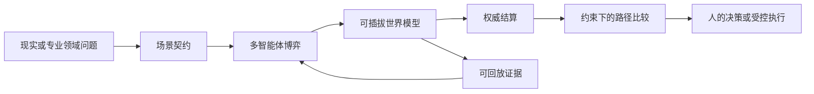
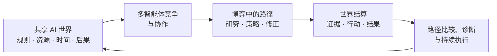
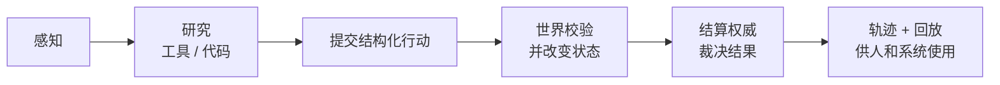
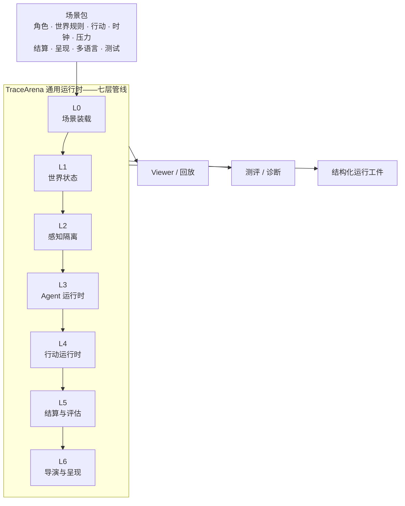

<div align="center">

# TraceArena

[](https://github.com/tonyhyworld/TraceArena/releases/latest)
[](https://tonyworld888-tracearena-demo.static.hf.space/index.html)
[](LICENSE)


### 面向所有人的开源 AI World OS

**定义目标、资源与规则 · 加载任意世界 · 多智能体博弈达成目标 · 全过程可演绎可见**

[](LICENSE)
[](https://github.com/tonyhyworld/TraceArena/actions/workflows/ci.yml)
[](CONTRIBUTING.zh-CN.md)

[English](README.md) · [在线演示](https://huggingface.co/spaces/tonyworld888/tracearena-demo) · [五分钟上手](docs/quickstart.zh-CN.md) · [本地运行](#本地运行一个可验证的世界) · [构建世界](#一起构建世界库)

</div>


## 两分钟了解 TraceArena

[](https://github.com/tonyhyworld/TraceArena/releases/download/v0.1.3/tracearena-demo.mp4)

*英语旁白 · 英语为主、中文为辅的双语画面 · 1080p。可[下载 MP4](https://github.com/tonyhyworld/TraceArena/releases/download/v0.1.3/tracearena-demo.mp4)，也可查看[可复现的 HyperFrames 视频工程](docs/video/tracearena-demo/)。*

> **TraceArena 让智能体进入真实约束的世界，用行动证明能力；让每一次研究、判断、
> 行动和结果都能被观看、解释、核验和复用。**

## 旗舰世界：资本市场专业评测

TraceArena 首先回答一个具体问题：**当两个投资 Agent 获得相同本金、证据边界、工具权限和市场时钟时，谁能做出更好的风险调整后决策，为什么？**

[`capital_market` Public Edition](backend/scenarios/capital_market/) 是专业评测场景包，不是荐股聊天机器人，也不是自动交易系统。价值型与成长型 Agent 在同一规则下研究、提交结构化组合行动，并接受相同的模拟成交与结算。

| 评测对象 | TraceArena 如何让它可审查 |
| --- | --- |
| 研究质量 | 外部观察记录来源、新鲜度与验证状态 |
| 决策纪律 | 买入、卖出或等待都必须满足行动 Schema 和证据规则 |
| 组合结果 | 模拟账本统一计入佣金、滑点和持仓变化，绝不连接券商下单 |
| 风险调整表现 | 同时报告组合收益、基准超额收益、最大回撤、换手率和成本 |
| 可复现性 | 观察、工具调用、行动、接受/拒绝事件与结算均可回放 |

用户可以先运行无 Key、合成数据的确定性 Replay，也可以接入自己的模型和已获授权的只读研究工具进行受控对比。本场景不构成投资建议，不连接券商，不执行真实订单。

资本市场是 TraceArena 的旗舰验证场景，而不是平台边界。同一套 OS 仍可通过场景包装载城市治理、医药研发、物流、运营或其他专业决策世界。

## 一条命令安装

在 macOS/Linux 中，下面一条命令会自动创建 Python 虚拟环境、安装后端依赖、安装完整 Vue
前端依赖，并生成本地前端配置：

```bash
git clone https://github.com/tonyhyworld/TraceArena.git
cd TraceArena
./scripts/install.sh
```

Windows PowerShell 用户运行 `./scripts/install.ps1`（如需指定解释器，可先设置 `$env:PYTHON_BIN="C:\\Python312\\python.exe"`）。安装器会创建 `.venv`，以 editable 模式
安装后端，执行 `npm ci` 安装完整前端，并且只在不存在时创建 `frontend/.env.local`。安装器
不会安装或保存任何 API Key。完整前端所需的 OS 后端/API 说明见[前端启动指南](frontend/README.md)。

如果系统的 `python3` 不是完整的 Python 3.10+（缺少 `venv/ensurepip`），可显式指定解释器：
`PYTHON_BIN=/path/to/python3.12 ./scripts/install.sh`。

## AI 世界理念：任何人都可以加载自己的世界

TraceArena 为所有人提供一套可以持续加载不同场景和世界的 AI World OS。你只需要定义这个世界的
**目标、资源、约束、工具、信息边界、结果标准和世界反馈方式**，就可以把资本市场验证、城市治理、医药研发、物流、
运营、机器人或任何你关心的问题装载进同一个运行时，再让多个 Agent 在这个世界中持续行动。

世界反馈不必等同于完整的物理数字孪生。场景可以使用**专家规则、确定性算法、训练后的 World Agent、专业模拟器、真实系统或可追踪的混合模型**。TraceArena 用统一 World Adapter 接入这六类实现，并记录版本、来源、假设、置信度、验证依据与适用边界。领域团队可以先从一个有用的有限模型起步，再逐步提高精度。

> **面向企业团队：** 可将一个边界清晰的真实工作流建模为可回放评测世界，对比 2–4 种 Agent/模型配置，交付可审阅的决策证据报告。试点起始价为人民币 29,800 元，详见[试点说明](docs/open_source_release/PILOT_ONE_PAGER.md)或[提交试点申请](.github/ISSUE_TEMPLATE/agent-evaluation-pilot.yml)。

这里的“世界”可以是真实问题，也可以先用可控的模拟或混合世界表达。长期愿景是：不同领域不再
各自从零搭建 Agent Demo，而是通过场景包把自己的世界加载到同一个 OS 中，让 AI 在行动前理解约束、
在竞争中比较路径、看见后果，并持续为了目标执行。

### 资源、目标、规则和结果如何被装载

| 专业世界要素 | 在 TraceArena 中的对应物 |
| --- | --- |
| 资源与状态 | 世界对象、预算、库存、生命周期状态 |
| 目标与优先级 | Agent 目标、评价指标和结算指标 |
| 规则与约束 | 校验器、权限、时钟、失败条件 |
| 工具与证据 | 能力 Schema、外部观察、来源与新鲜度 |
| 世界反馈 | 专家规则、算法、训练模型、模拟器、真实系统或混合模型 |
| 行动后果 | 权威事件、结算记录、资源和状态更新 |

### 核心是让 Agent 在世界中博弈，完成你定义的目标

单个 Agent 可以写出一个看似合理的方案，但它不能自己宣布方案有效。在同一个世界里，多个
Agent 围绕你定义的目标，带着不同策略、信息和风险边界竞争或协作；时间、资源和规则共同构成博弈。
世界模型接收行动并返回后果，独立结算权威再依据目标、资源、约束和结果标准比较不同路径，推动 Agent 找到
能够完成目标的路径。这里的“最佳”是**相对于你定义的世界条件的最佳**，不是脱离事实的万能最优解。



这是一种面向 Agent 时代的新开发范式：把“如何让 AI 解决一个复杂的现实问题”转化为“如何
声明这个世界的资源、目标、规则和结果”，然后让 Agent 沿着**感知 → 研究 → 行动 → 接收反馈 →
修正 → 持续执行**的目标循环工作，并在关键节点设置权限、预算和人工确认。

TraceArena 不是数据仓库，也不承诺所有问题都有通用最优答案。运行轨迹、证据和回放是可审计的
结果副产物，用来帮助人类检查、比较和改进决策，而不是产品的第一价值。

### 六类世界模型，四类结算权威

执行层支持 `rule_based`、`algorithmic`、`learned`、`simulator`、`reality`、`hybrid`，回答“世界如何变化”；现有 `simulation`、`external_reality`、`deterministic_verifier`、`hybrid` 四种结算类型回答“谁有权证明结果”。两个维度严格分开，因此训练后的 World Agent 可以帮助描述复杂后果，但其预测不会被自动包装成真实物理事实，也不会自动成为唯一胜负裁判。

具体接口参见 [World Model / Adapter SDK](docs/WORLD_ADAPTER_SDK.md)，统一定位参见[产品定位权威稿](docs/PRODUCT_POSITIONING.md)。

> **定位更新（2026 年 7 月）：**欢迎阅读[社区公告](https://github.com/tonyhyworld/TraceArena/discussions/12)，了解 AI World OS 的新方向，以及生态下一步要加载的专业领域问题。

### 你现在可以做什么

| 你的目标 | 从这里开始 |
| --- | --- |
| 不安装任何东西先看一次运行 | [打开在线 Demo](https://tonyworld888-tracearena-demo.static.hf.space/index.html) |
| 本地运行确定性 Replay | [五分钟上手](docs/quickstart.zh-CN.md) |
| 构建新的 Agent 世界 | [提出场景包](https://github.com/tonyhyworld/TraceArena/issues/2) |
| 为团队加载一个私有 AI 世界 | [启动 AI World 试点](.github/ISSUE_TEMPLATE/agent-evaluation-pilot.yml) |

每个入口只有一个下一步动作；公开 Replay 不需要 API Key。



它保留的不是脱离环境的“提示词—答案”对，而是完整的世界上下文：智能体看到了什么、调用了
哪些工具、引用了哪些证据、如何行动、世界为何接受或拒绝、以及结果如何。这样人类可以在真正
执行前比较候选路径，定位失败发生在研究、规划、工具、权限、规则还是结果层。运行证据可以
支持后续评测和改进，但 TraceArena 的核心价值是让专业领域问题可装载、可演绎、可博弈，并明确展示世界模型及其可信边界。

## 从“会回答”走向“能在世界中持续行动”

下一代 AI 不会只生活在聊天窗口中。它需要感知环境、借助工具研究、使用代码、提交
行动、面对约束、从失败中恢复，并承担行动的后果。

许多 Agent 框架在模型生成一段文字时就结束；许多 Benchmark 只给一个孤立答案打分。
两者都难以回答：智能体能否在一个共同且持续变化的世界中可靠地工作？TraceArena 运行
的正是这样的世界。

多个智能体获得受限观察和已获准能力，可以研究并提出结构化行动，但**不能自己宣布
成功**。场景的结算权威——规则、可执行校验器、已验证外部事实，或其明确组合——决定
什么能成为世界事实。最终留下的是可审计的运行，而不是一段有说服力的对话记录：人类可以
看见不同路径如何被验证、接受或淘汰，以及每次决策产生的真实后果。



## 为什么需要它

| 长期存在的问题 | TraceArena 的回答 |
| --- | --- |
| **真实 Agent 能力难检验。** 静态题目可能被记忆；单轮回答无法呈现工具使用、持续规划、修正和对结果负责的能力。 | 在同一世界、时钟、工具、资源和规则下运行智能体，评价连续轨迹，而不是一句回答。 |
| **Agent 决策是黑箱。** 只有最终结论，无法知道研究、证据、规划、执行还是结算在哪一层失败。 | 保留从观察、工具使用到行动、事件、结算理由和结果的完整链路。 |
| **现实问题很难交给 AI。** 资源、规则、权限、后果和人的确认流程通常散落在系统和经验中。 | 用场景契约把问题装载为可运行的世界，在真实执行前比较候选路径并保留依据。 |
| **强大的 AI 行为难被看见。** 最有价值的过程常被困在日志、JSON 和后台任务中。 | 从同一事实账本生成回放和呈现，让观众理解发生了什么，而不是编造故事。 |

## 一局运行，四类价值

同一局权威运行服务不同角色。这不是四个彼此分裂的产品，而是同一个事实源的四种视图。

| 面向谁 | 获得什么 | 核心价值 |
| --- | --- | --- |
| **观众 / 内容团队** | 可观看的事实运行：角色、判断、冲突、结果与回放。 | AI 行为变得可理解，而不是变成脚本化表演。 |
| **企业 / 研究机构** | 在共同约束下进行连续能力测评。 | 用完成率、风险、效率和稳定性比较模型或外部 Agent，而不只比较表达能力。 |
| **Agent 开发者** | 行动、工具、证据和结算轨迹。 | 定位失败来自规划、工具、证据、协议格式、规则校验还是最终结果。 |
| **数据 / 评测团队** | 结构化的观察、行动、反馈、结算和回放。 | 复盘路径差异，定位能力瓶颈，并为后续评测与改进提供证据。 |

共同目标是让 Agent 能力成为可以**被观看、被比较、被解释、被持续优化**的生产要素。

## 产品架构：场景包定义世界，OS 负责运行世界

TraceArena 将领域知识与通用运行时分离。场景包定义角色、目标、行动、工具、可见性、
资源含义、压力、结算规则、呈现词汇和测试；OS 则负责装载、调度、记录、校验与回放。



### 七层架构

| 层 | 职责 | 它为什么是平台边界 |
| --- | --- | --- |
| **L0 — 场景装载** | 装载、校验并组装场景契约及其声明能力。 | 新世界通过声明进入，而不是分叉引擎。 |
| **L1 — 世界状态** | 维护对象、资源、生命周期、指标和因果状态变化。 | 世界拥有唯一且有状态的事实来源。 |
| **L2 — 感知隔离** | 只向各角色投射其有权获得的观察。 | 智能体在明确的信息边界下竞争或协作。 |
| **L3 — Agent 运行时** | 运行 Agent 循环、提示词、记忆钩子、能力发现和 Provider 接入。 | 不同模型或外部 Agent 可面对同一世界契约。 |
| **L4 — 行动运行时** | 解析、校验、授权并提交有类型的行动。 | 口头宣称“做了”不等于世界行动。 |
| **L5 — 结算与评估** | 应用声明的权威、证据要求、规则和结果账务。 | 模型无法靠说服裁判来获胜。 |
| **L6 — 导演与呈现** | 选择公开事实，并转化为回放/呈现命令。 | 可观看性来自事实，同时不暴露私有推理或编造事件。 |

架构红线很简单：**运行时不应认识任何场景的业务词汇。**持仓、城市政策、代码提交等
都属于场景包，而不属于通用 OS。仓库检查帮助守住这条边界，使新领域可复用同一套执行、
记录、结算与回放底座。

### Agent Harness：让模型真正干活，而非叙述自己会干活

一个决策周期中，Agent 可以经历如下“研究到行动”循环：

```text
发现能力 → 调用获准工具 → 检查结果 → 分析/运行代码
→ 引用证据 → 提交结构化行动 → 接受/拒绝反馈 → 更新下一次决策
```

运行时包含能力编排、Provider 接入、面向沙箱的组件、行动契约、轨迹记录与反馈通道；
场景包决定允许使用哪些工具和行动。由此，工具使用与失败恢复成为评测中可见的能力，
而不是藏在实现细节里。

## 四类世界：结果究竟由谁裁决

TraceArena 按结算权威对世界行为分类。这不仅是标签：它告诉场景作者需要提供什么证据，
也告诉审阅者应该如何解释结果。

| 类型 | 谁裁决结果 | 适合的世界 | 解释链 |
| --- | --- | --- | --- |
| **模拟世界** `simulation` | 场景规则或世界物理。 | 经营、治理、谈判、资源策略。 | 观察 → 行动 → 世界转移 → 指标 |
| **外部现实** `external_reality` | 已验证的外部观察；运行时记录事实而不是编造事实。 | 行情、天气、网页任务、真实工具执行。 | 任务 → 观测 → 来源校验 → 事实 → 结果 |
| **确定性校验** `deterministic_verifier` | 可执行、可复现的校验器，绝不使用 LLM 作为裁判。 | 代码测试、数学答案、格式检查、订单合法性。 | 提交 → 结构化答案 → 校验裁决 → 得分 |
| **混合** `hybrid` | 已验证外部事实与确定性场景规则的组合。 | 投资模拟、数据驱动的业务推演。 | 研究 → 证据 → 行动 → 规则/账本结算 → 结果 |

一个行动可以同时需要多种权威。例如市场场景可用确定性规则校验订单形状，使用已验证
价格作为外部输入，再由模拟组合账本完成最终结算。

## 信任模型：事实在前，叙事在后

TraceArena 的核心记录用于回答“发生了什么”以及“谁有权做出这一判断”：

| 契约 / 记录 | 记录内容 | 主要消费者 |
| --- | --- | --- |
| `HarnessTrace` | 感知、规划钩子、工具/代码活动和最终行动路径 | 诊断、评测、数据处理 |
| `WorldAction` | 角色向世界提交的结构化请求 | 行动运行时、审计 |
| `ExternalObservation` | 外部数据、来源、新鲜度和验证状态 | 结算、证据审阅 |
| `WorldEvent` | 被接受的世界事实与状态转移 | 回放、呈现、结算 |
| `SettlementRecord` | 结果、证据/规则、版本和裁决权威 | 评分、审计、导出 |
| `DirectorPlan` | 被选中用于呈现的事实引用 | Viewer 与回放 |

呈现层位于账本之后。导演/呈现层可以选择哪些公开事实值得被看见、如何安排节奏，但不能
创造行动、预测结果或自行裁定胜负。因此 Viewer 能回答“发生了什么”，而审计视图能
回答“为什么、依据什么、由谁裁决”。

## 本地运行一个可验证的世界

### 无 Key 的确定性回放

[](https://codespaces.new/tonyhyworld/TraceArena?quickstart=1)

如果不想在本机配置 Python 和 Node，可以直接在 GitHub Codespaces 中打开仓库。仓库内置的开发容器会安装开发依赖并转发前后端端口；Codespaces 是否收费取决于你的 GitHub 账户额度和套餐。无 Key 回放本身不需要模型或券商凭证。

前置条件：Python 3.10 或更高版本（推荐 Python 3.11）。创建虚拟环境前请先确认解释器
版本；如果系统的 `python3` 仍指向 Python 3.9，请显式选择更新版本的可执行文件。

```bash
python3 --version
python3 -m venv .venv
source .venv/bin/activate
python -m pip install --upgrade pip
python -m pip install -e ".[dev]"
PYTHONPATH=backend python backend/scripts/market_replay.py \
  --fixture examples/market_replay/fixture.json \
  --output ./runs/market_replay_demo \
  --locale zh-CN
```

内置 [`capital_market` Public Edition](backend/scenarios/capital_market/) 提供两条路径：默认回放使用合成 fixture 和模拟账本，不发起模型调用、不需要券商账户，也不执行真实下单；进阶用户可以自带模型，并在合法授权下启用只读市场研究工具。场景不会连接券商或提交真实订单，不构成投资建议。欢迎加入 [Physical World OS 合约讨论](https://github.com/tonyhyworld/TraceArena/discussions/14)，交流首次运行体验和场景包想法。使用 `--locale en-US` 可切换
英文呈现文本。

想看非金融示例？请阅读[应急响应世界](examples/incident_response_world/README.md)，运行它的确定性 fixture，并观察一次被明确拒绝的提前结案行动。

研究者还可以阅读[应急响应 Benchmark Card](docs/benchmarks/incident-response-v0.md)，了解评测问题、指标、结算权威和当前限制。

如果想先检查证据再安装，可以下载 [v0.1.6 回放证据包](https://github.com/tonyhyworld/TraceArena/releases/download/v0.1.6/tracearena-v0.1.6-replay.zip)，直接查看其中的 `summary.md`、`run_manifest.json` 和 `replay_deterministic.json`；也可以查看[应急响应 Run of the Week #2](https://github.com/tonyhyworld/TraceArena/discussions/11)。最新的非金融 Benchmark 可下载 [v0.1.7 应急响应资产包](https://github.com/tonyhyworld/TraceArena/releases/download/v0.1.7/tracearena-v0.1.7-incident-response.zip)，或阅读 [v0.1.7 发布说明](https://github.com/tonyhyworld/TraceArena/releases/tag/v0.1.7)。

### Hugging Face 模型

TraceArena 可以通过现有的 OpenAI 兼容适配器，将对话型 Agent 路由到
Hugging Face Inference Providers。配置 `HF_TOKEN`，将 Agent 的
`provider` 设置为 `huggingface`，并使用 Hugging Face 模型仓库 ID（例如
`deepseek-ai/DeepSeek-R1:fastest`）。默认地址为
`https://router.huggingface.co/v1`；使用兼容网关时可通过 `HF_BASE_URL`
覆盖。该能力是可选项，不影响无需密钥的 replay 演示。

可用现代浏览器直接打开 `frontend/public_viewer/index.html`，离线检查
`run_manifest.json` 与 `replay_deterministic.json`。

### 完整 AI World 前端

仓库中的 [`frontend/`](frontend/) 现在包含本地 AI World 使用的完整 Vue/Vite
前端：登录与认证、运营控制台、观众端渲染、场景工厂、运行归档、分析视图、双语界面和
WebSocket 呈现层；匹配的认证、业务 API 与 WebSocket 的 TraceArena OS 后端也已放在
[`backend/`](backend/)。安装完成后运行 `./scripts/start.sh` 即可同时启动前后端；账号创建和
接口说明见 [`frontend/README.md`](frontend/README.md)。

### 本地 Self-hosted 开发者控制台

```bash
docker compose up --build
```

打开 `http://127.0.0.1:8000`，可选择场景语言、运行无 Key Replay、配置 Provider/模型、
临时输入 API Key，并查看运行状态及行动/事件/结算。

**安全边界：**无登录控制台只绑定 localhost。Key 只在当前请求中使用，不持久化、不记录、
不回传，也不写入环境变量。它有意不是可直接暴露公网的企业控制台；公网部署必须接入
认证、权限、密钥托管和审计能力。

## 一起构建世界库

新贡献者可以先阅读[五分钟上手](docs/quickstart.zh-CN.md)，再复制[场景包模板](examples/scenario_pack_template/)。

每一个高质量场景包都可以为生态增加一条问题求解线、一条测评线和一条内容线。只要一个领域
可以定义角色、目标、允许行动、环境反馈和可负责的结果，它就可以成为一个世界。

```text
your_scenario/
├── manifest.json              # 身份、能力、入口
├── agents/                    # 角色与提示词契约
├── world/                     # 行动、工具、资源、可见性、指标
├── settlement/                # 结算权威与结果规则
├── presentation.yaml          # 公开呈现词汇与绑定
├── locales/                   # 可选多语言覆盖
└── tests/                     # 校验与回放预期
```

请从内置 [`capital_market`](backend/scenarios/capital_market/) 参考场景包开始，再阅读
[场景包开发指南](docs/scenario-pack-development-guide.zh-CN.md)。高质量贡献应明确结算权威、为重要
行动保留证据、提供可复现 fixture，并记录所有素材/数据的再分发权。

如果你想提出一个公开的 Agent 评测基准，请使用[基准提案表单](.github/ISSUE_TEMPLATE/benchmark-proposal.yml)。

欢迎代码评审、企业运营、治理、教育、科研、商业分析与策略博弈等领域的场景包；也欢迎
校验器、工具适配器、回放可视化、测试 fixture、翻译和文档。我们的目标是共建一个让
智能体必须行动、而非只需回答的世界库。

## 社区参与与商业支持

TraceArena 欢迎场景包作者、Agent 开发者、评测人员、研究者，以及需要把自己的工具和结果
规则接入 AI 世界的企业团队。请从[贡献指南](CONTRIBUTING.zh-CN.md)、[场景包开发指南](docs/scenario-pack-development-guide.zh-CN.md)和[世界路线图](docs/open_source_release/WORLD_ROADMAP.md)开始。

如果企业需要定制领域场景、搭建评测套件、接入模型/工具，或部署生产环境，请查看
[商业支持说明](docs/commercial-support.zh-CN.md)。开源运行时继续采用 Apache-2.0；付费内容是围绕
开源运行时提供的实施、集成、场景设计和运营支持。

如果你希望先从一个明确范围开始，请阅读 [10 天 AI World 试点说明](docs/agent-evaluation-pilot.md)，其中列出了交付物、验收标准和人民币 29,800 元起的起始价格。

如果你关心开放基准和开源项目的可持续资金路径，请参阅[资助路线研究笔记](docs/open_source_release/FUNDING_PATHS.md)。

如果你需要技术会议、研究合作或媒体介绍素材，请参阅[创始人介绍](docs/FOUNDER_PROFILE.md)。

## 公开范围与贡献规则

公开仓包含认证和本地运营运行时，但不包含私有凭证、客户数据、私有运行档案和私有场景。
请勿提交 API Key 或没有明确再分发权的素材/数据。发起 PR 前请阅读
[贡献指南](CONTRIBUTING.zh-CN.md)、[安全政策](SECURITY.zh-CN.md) 与
[治理规则](GOVERNANCE.zh-CN.md)。

## 许可证

版权所有 © 2026 张诺亚。项目采用 Apache License 2.0，详见 [LICENSE](LICENSE) 与
[NOTICE](NOTICE)。

## 引用 TraceArena

研究和技术文章可以使用仓库中的 [`CITATION.cff`](CITATION.cff) 元数据，统一引用本项目。
