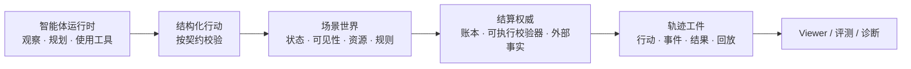

<div align="center">

# TraceArena

**面向真实约束世界的开源多智能体运行时：真实工具、可验证结果、可观看运行。**

[](LICENSE)
[](https://github.com/tonyhyworld/TraceArena/actions/workflows/ci.yml)
[](CONTRIBUTING.zh-CN.md)

[English](README.md) · [快速开始](#本地运行一个可验证的世界) · [构建场景包](#一起扩展世界库)

</div>


## 智能体应该为“实际发生的结果”负责，而不只是说得好听

许多 Agent 框架在模型输出一段文字时就结束了。但当智能体需要研究、调用工具、
消耗资源、提交结构化行动并承受后果时，只有回答远远不够。团队还需要能回答：
它依据了什么？哪条规则接受或拒绝了行动？结果能否复现？

TraceArena 是一个持续演化的共享世界运行时。多个智能体在受限观察下使用已获准的
能力，并提交有类型的行动；最终成为“世界事实”的内容由场景规则与结算权威决定，
而不是由 LLM 自评。一次运行会保留为可检查的轨迹。

| 现实问题 | TraceArena 带来的能力 |
| --- | --- |
| 聊天答案遮蔽过程，无法独立核验。 | 保留从观察、行动到事件、结算和结果的完整链条。 |
| 静态 Benchmark 容易变成背题，只测单轮回答。 | 在相同时间、规则、资源和压力下评估连续决策。 |
| 每个业务都把领域规则焊死在 Agent 应用里。 | 用场景包表达世界，让通用运行时保持通用。 |
| 演示很好看，却很难被信任和解释。 | 产出可离线检查的回放工件，让审阅者能追溯结果。 |

它为四类人创造价值：研究者可比较 Agent，产品团队可诊断工具使用行为，运营者可
审阅关键运行，世界构建者则获得可复用的执行与结算底座。

## 一张图看懂系统



关键的边界在于：智能体可以提出行动，**世界才负责裁决**。场景包声明一个世界的
词汇与规则；通用运行时执行生命周期、保留轨迹并导出可回放工件。

## 本仓库包含什么

- **场景装载与契约**：加载角色、行动、工具、可见性、资源、指标、呈现与结算配置；
- **按 tick 推进的多智能体运行时**：推进共享世界的观察、行动校验、事件产生和权威结算；
- **轨迹与确定性回放**：保存运行清单与回放数据，支持事后离线检查；
- **场景/运行时边界校验**：用验证与纯净度检查，避免领域规则渗入通用 OS；
- **可运行的资本市场示例**：使用合成 fixture 和模拟账本，无需模型 Key、券商账户或真实下单；
- **本地 Self-hosted 控制台**：可信 localhost 下的回放、临时模型配置、运行状态和工件查看。

资本市场场景包演示的是一个**混合世界**：市场观察可供智能体研究，而场景中的模拟
账本负责结算组合。这是仿真与评测基础设施，不构成投资建议，也不是实盘交易系统。

## 本地运行一个可验证的世界

### 无 Key 的确定性回放

```bash
python -m venv .venv
source .venv/bin/activate
python -m pip install -e ".[dev]"
PYTHONPATH=backend python backend/scripts/market_replay.py \
  --fixture examples/market_replay/fixture.json \
  --output ./runs/market_replay_demo \
  --locale zh-CN
```

输出中含有运行清单和确定性回放；改用 `--locale en-US` 即可获得英文呈现文本。
可用现代浏览器直接打开 `frontend/public_viewer/index.html` 离线查看工件；Viewer 不含
登录、后端或模型接入。

### 本地开发者控制台

```bash
docker compose up --build
```

打开 `http://127.0.0.1:8000`。控制台支持场景语言、无 Key Replay、模型提供商/模型名、
临时 API Key、运行状态以及行动/事件/结算查看。

**安全边界：**无登录控制台只绑定 localhost。Key 只在当前请求的内存中使用，不持久化、
不记录、不回传、也不写入环境变量。它不是可直接暴露公网的运营后台；公网部署必须
自行补齐认证、权限、密钥托管和审计集成。

## 一起扩展世界库

TraceArena 的价值会随“世界库”增长。最有价值的贡献，是构建一个让智能体面对真实、
可测试约束的场景包，而不只是把一个提示词换成另一个提示词。

```text
your_scenario/
├── manifest.json              # 身份、能力契约、入口
├── agents/                    # 角色与提示词契约
├── world/                     # 行动、工具、资源、可见性、指标
├── settlement/                # 结算权威与结果规则
├── presentation.yaml          # 呈现词汇与绑定
├── locales/                   # 可选多语言覆盖
└── tests/                     # 校验与回放预期
```

好的场景包要明确“由谁裁决结果”：可执行校验器、场景物理规则、可验证的外部事实，
或者它们清晰定义的混合。它还应声明智能体能看什么、能做什么、什么结果才算被接受，
并提供可复现的测试/回放 fixture。请从内置
[`capital_market`](backend/scenarios/capital_market/) 场景包开始，阅读
[场景包贡献指南](docs/scenario-pack-guide.zh-CN.md)。

欢迎代码评审、运营、治理、教育、研究等领域的新场景包；也欢迎校验器、回放可视化、
工具适配器、测试、翻译和文档。每一个可复现的世界，都会为整个生态扩展一条评测线与
一条数据线。

## 公开边界与贡献规则

公开运行时不包含私有认证、用户管理、长期密钥存储、客户数据和私有场景。请勿提交
API Key、私有运行档案，或没有明确再分发权的素材/数据。提交 PR 前请阅读
[贡献指南](CONTRIBUTING.zh-CN.md)、[安全政策](SECURITY.zh-CN.md) 和
[治理规则](GOVERNANCE.zh-CN.md)。

## 许可证

版权所有 © 2026 张诺亚。项目采用 Apache License 2.0，详见 [LICENSE](LICENSE) 与
[NOTICE](NOTICE)。
