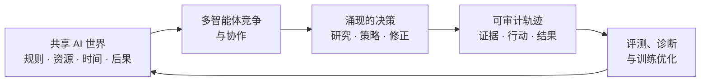
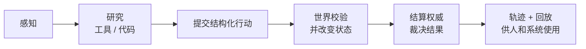
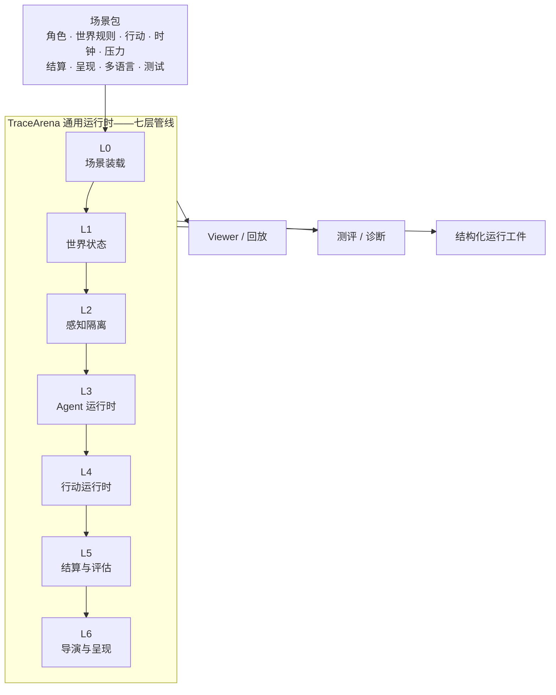

<div align="center">

# TraceArena

### 面向真实约束世界的开源多智能体运行时

**真实工具 · 可执行规则 · 可验证结果 · 可观看运行**

[](LICENSE)
[](https://github.com/tonyhyworld/TraceArena/actions/workflows/ci.yml)
[](CONTRIBUTING.zh-CN.md)

[English](README.md) · [在线演示](https://huggingface.co/spaces/tonyworld888/tracearena-demo) · [五分钟上手](docs/quickstart.zh-CN.md) · [本地运行](#本地运行一个可验证的世界) · [构建世界](#一起构建世界库)

</div>


## 两分钟了解 TraceArena

[](https://github.com/tonyhyworld/TraceArena/releases/download/v0.1.3/tracearena-demo.mp4)

*英语旁白 · 英语为主、中文为辅的双语画面 · 1080p。可[下载 MP4](https://github.com/tonyhyworld/TraceArena/releases/download/v0.1.3/tracearena-demo.mp4)，也可查看[可复现的 HyperFrames 视频工程](docs/video/tracearena-demo/)。*

> **TraceArena 让智能体进入真实约束的世界，用行动证明能力；让每一次研究、判断、
> 行动和结果都能被观看、解释、核验和复用。**

## 一条命令安装

在 macOS/Linux 中，下面一条命令会自动创建 Python 虚拟环境、安装后端依赖、安装完整 Vue
前端依赖，并生成本地前端配置：

```bash
git clone https://github.com/tonyhyworld/TraceArena.git
cd TraceArena
./scripts/install.sh
```

Windows PowerShell 用户运行 `./scripts/install.ps1`。安装器会创建 `.venv`，以 editable 模式
安装后端，执行 `npm ci` 安装完整前端，并且只在不存在时创建 `frontend/.env.local`。安装器
不会安装或保存任何 API Key。完整前端所需的 OS 后端/API 说明见[前端启动指南](frontend/README.md)。

## AI 世界理念：智能在世界中涌现，价值数据在过程中沉淀

TraceArena 建立在一个朴素判断之上：智能体最有意义的智能，不会只从一条孤立提示词中
显现；它会在多个智能体共享同一个世界、追求冲突或互补目标、争夺有限资源、面对不断
变化的后果、并持续修正决策时涌现出来。

因此，**AI 世界不是一个仿真背景板，而是一个活的实验环境。**在这里，研究质量、工具
使用、风险控制、协作、竞争、失败恢复和长程判断，都会通过行动被看见。竞争尤其重要：
世界不会等待某个智能体给出理想答案；时间、资源、信息边界和其他智能体的行动共同形成
压力，迫使策略必须适应真实变化。

这也是 TraceArena 面向 Agent 时代提出的一种训练与开发范式：



它不再把训练数据只视为脱离环境的“提示词—答案”对，而是保留完整决策上下文：智能体
看到了什么、调用了哪些工具、引用了哪些证据、如何行动、世界为何接受或拒绝、以及客观
结果如何。当世界契约与结算规则被明确声明时，这类轨迹有机会比纯文本样本更贴近真实的
决策工作，并可被筛选、横向比较和复用，用于工具使用、长程规划、失败恢复和能力评测。
这里并不宣称竞争天然让智能体变强；它提供的是一个可以验证“是否变强”的环境，以及一种
让高价值决策过程持续沉淀为数据资产的方法。

## 从“会回答”走向“能在世界中持续行动”

下一代 AI 不会只生活在聊天窗口中。它需要感知环境、借助工具研究、使用代码、提交
行动、面对约束、从失败中恢复，并承担行动的后果。

许多 Agent 框架在模型生成一段文字时就结束；许多 Benchmark 只给一个孤立答案打分。
两者都难以回答：智能体能否在一个共同且持续变化的世界中可靠地工作？TraceArena 运行
的正是这样的世界。

多个智能体获得受限观察和已获准能力，可以研究并提出结构化行动，但**不能自己宣布
成功**。场景的结算权威——规则、可执行校验器、已验证外部事实，或其明确组合——决定
什么能成为世界事实。最终留下的是可审计的运行，而不是一段有说服力的对话记录：其中既
保留涌现出的智能，也保留产生这种智能的决策过程。



## 为什么需要它

| 长期存在的问题 | TraceArena 的回答 |
| --- | --- |
| **真实 Agent 能力难检验。** 静态题目可能被记忆；单轮回答无法呈现工具使用、持续规划、修正和对结果负责的能力。 | 在同一世界、时钟、工具、资源和规则下运行智能体，评价连续轨迹，而不是一句回答。 |
| **Agent 决策是黑箱。** 只有最终结论，无法知道研究、证据、规划、执行还是结算在哪一层失败。 | 保留从观察、工具使用到行动、事件、结算理由和结果的完整链路。 |
| **高价值行为数据稀缺。** 纯文本缺少环境、证据、反馈和客观后果，难以成为可靠训练材料。 | 将每一局沉淀为可复用的证据、决策、行动、反馈与结果。 |
| **强大的 AI 行为难被看见。** 最有价值的过程常被困在日志、JSON 和后台任务中。 | 从同一事实账本生成回放和呈现，让观众理解发生了什么，而不是编造故事。 |

## 一局运行，四类价值

同一局权威运行服务不同角色。这不是四个彼此分裂的产品，而是同一个事实源的四种视图。

| 面向谁 | 获得什么 | 核心价值 |
| --- | --- | --- |
| **观众 / 内容团队** | 可观看的事实运行：角色、判断、冲突、结果与回放。 | AI 行为变得可理解，而不是变成脚本化表演。 |
| **企业 / 研究机构** | 在共同约束下进行连续能力测评。 | 用完成率、风险、效率和稳定性比较模型或外部 Agent，而不只比较表达能力。 |
| **Agent 开发者** | 行动、工具、证据和结算轨迹。 | 定位失败来自规划、工具、证据、协议格式、规则校验还是最终结果。 |
| **数据 / 训练团队** | 结构化行为轨迹，包括成功与失败尝试。 | 为工具使用、长程规划、失败恢复、偏好优化与评测生产材料。 |

共同目标是让 Agent 能力成为可以**被观看、被比较、被解释、被持续优化**的生产要素。

## 产品架构：场景包定义世界，OS 负责运行世界

TraceArena 将领域知识与通用运行时分离。场景包定义角色、目标、行动、工具、可见性、
资源含义、压力、结算规则、呈现词汇和测试；OS 则负责装载、调度、记录、校验与回放。



### 七层架构

| 层 | 职责 | 它为什么是平台边界 |
| --- | --- | --- |
| **L0 — 场景装载** | 装载、校验并组装场景契约及其声明能力。 | 新世界通过声明进入，而不是分叉引擎。 |
| **L1 — 世界状态** | 维护对象、资源、生命周期、指标和因果状态变化。 | 世界拥有唯一且有状态的事实来源。 |
| **L2 — 感知隔离** | 只向各角色投射其有权获得的观察。 | 智能体在明确的信息边界下竞争或协作。 |
| **L3 — Agent 运行时** | 运行 Agent 循环、提示词、记忆钩子、能力发现和 Provider 接入。 | 不同模型或外部 Agent 可面对同一世界契约。 |
| **L4 — 行动运行时** | 解析、校验、授权并提交有类型的行动。 | 口头宣称“做了”不等于世界行动。 |
| **L5 — 结算与评估** | 应用声明的权威、证据要求、规则和结果账务。 | 模型无法靠说服裁判来获胜。 |
| **L6 — 导演与呈现** | 选择公开事实，并转化为回放/呈现命令。 | 可观看性来自事实，同时不暴露私有推理或编造事件。 |

架构红线很简单：**运行时不应认识任何场景的业务词汇。**持仓、城市政策、代码提交等
都属于场景包，而不属于通用 OS。仓库检查帮助守住这条边界，使新领域可复用同一套执行、
记录、结算与回放底座。

### Agent Harness：让模型真正干活，而非叙述自己会干活

一个决策周期中，Agent 可以经历如下“研究到行动”循环：

```text
发现能力 → 调用获准工具 → 检查结果 → 分析/运行代码
→ 引用证据 → 提交结构化行动 → 接受/拒绝反馈 → 更新下一次决策
```

运行时包含能力编排、Provider 接入、面向沙箱的组件、行动契约、轨迹记录与反馈通道；
场景包决定允许使用哪些工具和行动。由此，工具使用与失败恢复成为评测中可见的能力，
而不是藏在实现细节里。

## 四类世界：结果究竟由谁裁决

TraceArena 按结算权威对世界行为分类。这不仅是标签：它告诉场景作者需要提供什么证据，
也告诉审阅者应该如何解释结果。

| 类型 | 谁裁决结果 | 适合的世界 | 解释链 |
| --- | --- | --- | --- |
| **模拟世界** `simulation` | 场景规则或世界物理。 | 经营、治理、谈判、资源策略。 | 观察 → 行动 → 世界转移 → 指标 |
| **外部现实** `external_reality` | 已验证的外部观察；运行时记录事实而不是编造事实。 | 行情、天气、网页任务、真实工具执行。 | 任务 → 观测 → 来源校验 → 事实 → 结果 |
| **确定性校验** `deterministic_verifier` | 可执行、可复现的校验器，绝不使用 LLM 作为裁判。 | 代码测试、数学答案、格式检查、订单合法性。 | 提交 → 结构化答案 → 校验裁决 → 得分 |
| **混合** `hybrid` | 已验证外部事实与确定性场景规则的组合。 | 投资模拟、数据驱动的业务推演。 | 研究 → 证据 → 行动 → 规则/账本结算 → 结果 |

一个行动可以同时需要多种权威。例如市场场景可用确定性规则校验订单形状，使用已验证
价格作为外部输入，再由模拟组合账本完成最终结算。

## 信任模型：事实在前，叙事在后

TraceArena 的核心记录用于回答“发生了什么”以及“谁有权做出这一判断”：

| 契约 / 记录 | 记录内容 | 主要消费者 |
| --- | --- | --- |
| `HarnessTrace` | 感知、规划钩子、工具/代码活动和最终行动路径 | 诊断、评测、数据处理 |
| `WorldAction` | 角色向世界提交的结构化请求 | 行动运行时、审计 |
| `ExternalObservation` | 外部数据、来源、新鲜度和验证状态 | 结算、证据审阅 |
| `WorldEvent` | 被接受的世界事实与状态转移 | 回放、呈现、结算 |
| `SettlementRecord` | 结果、证据/规则、版本和裁决权威 | 评分、审计、导出 |
| `DirectorPlan` | 被选中用于呈现的事实引用 | Viewer 与回放 |

呈现层位于账本之后。导演/呈现层可以选择哪些公开事实值得被看见、如何安排节奏，但不能
创造行动、预测结果或自行裁定胜负。因此 Viewer 能回答“发生了什么”，而审计视图能
回答“为什么、依据什么、由谁裁决”。

## 本地运行一个可验证的世界

### 无 Key 的确定性回放

前置条件：Python 3.10 或更高版本（推荐 Python 3.11）。创建虚拟环境前请先确认解释器
版本；如果系统的 `python3` 仍指向 Python 3.9，请显式选择更新版本的可执行文件。

```bash
python3 --version
python3 -m venv .venv
source .venv/bin/activate
python -m pip install --upgrade pip
python -m pip install -e ".[dev]"
PYTHONPATH=backend python backend/scripts/market_replay.py \
  --fixture examples/market_replay/fixture.json \
  --output ./runs/market_replay_demo \
  --locale zh-CN
```

内置 `capital_market` 回放使用合成 fixture 和模拟账本，不发起模型调用、不需要券商账户，
也不执行真实下单。它是评测/仿真示例，不构成投资建议。使用 `--locale en-US` 可切换
英文呈现文本。

可用现代浏览器直接打开 `frontend/public_viewer/index.html`，离线检查
`run_manifest.json` 与 `replay_deterministic.json`。

### 完整 AI World 前端

仓库中的 [`frontend/`](frontend/) 现在包含本地 AI World 使用的完整 Vue/Vite
前端：登录与认证、运营控制台、观众端渲染、场景工厂、运行归档、分析视图、双语界面和
WebSocket 呈现层。它与上面的无 Key 静态回放 Demo 是两套用途不同的前端；完整前端需要
运行提供认证 API、业务 API 和 WebSocket 的 TraceArena OS 后端（默认端口 8001）。安装与
启动方式见 [`frontend/README.md`](frontend/README.md)。

### 本地 Self-hosted 开发者控制台

```bash
docker compose up --build
```

打开 `http://127.0.0.1:8000`，可选择场景语言、运行无 Key Replay、配置 Provider/模型、
临时输入 API Key，并查看运行状态及行动/事件/结算。

**安全边界：**无登录控制台只绑定 localhost。Key 只在当前请求中使用，不持久化、不记录、
不回传，也不写入环境变量。它有意不是可直接暴露公网的企业控制台；公网部署必须接入
认证、权限、密钥托管和审计能力。

## 一起构建世界库

新贡献者可以先阅读[五分钟上手](docs/quickstart.zh-CN.md)，再复制[场景包模板](examples/scenario_pack_template/)。

每一个高质量场景包都可以为生态增加一条测评线、一条内容线和一条数据线。只要一个领域
可以定义角色、目标、允许行动、环境反馈和可负责的结果，它就可以成为一个世界。

```text
your_scenario/
├── manifest.json              # 身份、能力、入口
├── agents/                    # 角色与提示词契约
├── world/                     # 行动、工具、资源、可见性、指标
├── settlement/                # 结算权威与结果规则
├── presentation.yaml          # 公开呈现词汇与绑定
├── locales/                   # 可选多语言覆盖
└── tests/                     # 校验与回放预期
```

请从内置 [`capital_market`](backend/scenarios/capital_market/) 参考场景包开始，再阅读
[场景包开发指南](docs/scenario-pack-development-guide.zh-CN.md)。高质量贡献应明确结算权威、为重要
行动保留证据、提供可复现 fixture，并记录所有素材/数据的再分发权。

欢迎代码评审、企业运营、治理、教育、科研、商业分析与策略博弈等领域的场景包；也欢迎
校验器、工具适配器、回放可视化、测试 fixture、翻译和文档。我们的目标是共建一个让
智能体必须行动、而非只需回答的世界库。

## 公开范围与贡献规则

公开运行时不包含私有认证、长期密钥存储、客户数据和私有场景。请勿提交 API Key、私有
运行档案或没有明确再分发权的素材/数据。发起 PR 前请阅读
[贡献指南](CONTRIBUTING.zh-CN.md)、[安全政策](SECURITY.zh-CN.md) 与
[治理规则](GOVERNANCE.zh-CN.md)。

## 许可证

版权所有 © 2026 张诺亚。项目采用 Apache License 2.0，详见 [LICENSE](LICENSE) 与
[NOTICE](NOTICE)。
