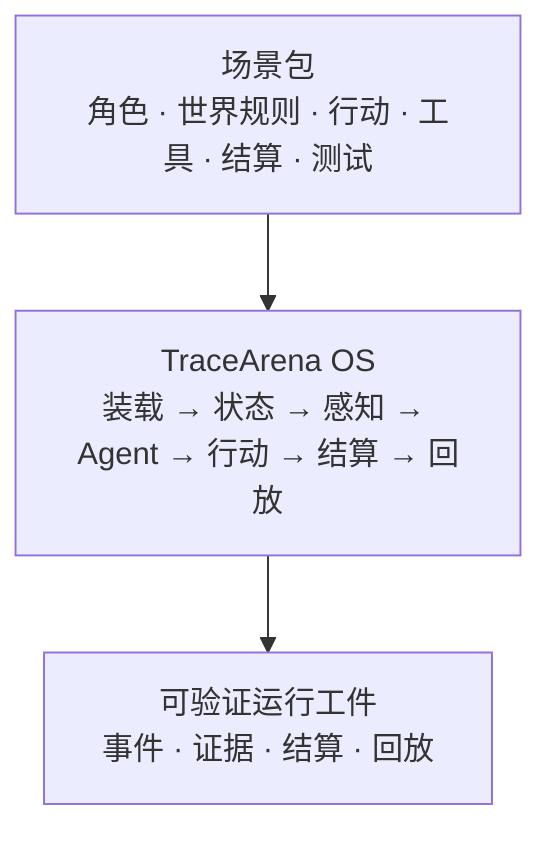

# 场景包开发指南

[English quick guide](scenario-pack-guide.md) · [中文快速清单](scenario-pack-guide.zh-CN.md)

> 适用版本：TraceArena `v0.1.9`，场景 API `1.0`。本文以本公开仓的加载器、编译器和校验器实际行为为准；若使用更新的主分支，请以对应测试和校验器输出为最终依据。

场景包让开发者定义一个 AI 世界；TraceArena 负责运行这个世界。一个合格场景包应当在**不修改通用 OS** 的前提下，独立定义角色、行动、约束、结果和可审计轨迹。

## 场景包应该放在哪里？

| 使用方式 | 放置位置 | 说明 |
| --- | --- | --- |
| 向本仓贡献并希望随 TraceArena 发布 | `backend/scenarios/<scenario-slug>/` | 推荐的上游贡献位置；例如 `backend/scenarios/research_duel/`。一个场景一个目录。 |
| 在自己的项目或部署中试验 | 任意本地目录 | 通过 `FrameworkConfig.scenario_path`，或脚本的 `--scenario /absolute/path` 显式指向它。 |
| 私有多用户部署 | `user_data/<user_id>/scenarios/<scenario-name>/` | 这是完整 `EngineManager` 的私有覆盖路径；不是公开 Demo Console 的自动能力。 |

请使用稳定、全小写、下划线或短横线组成的目录名，例如 `research_duel`。目录名是加载入口，`manifest.json` 中的 `scenario_id` 是跨运行记录的稳定身份；发布后不要随展示文案改变它。

> 公开 Demo Console 目前固定展示内置 `capital_market` 场景。把新包放入目录后，可用 CLI/配置加载并验证；若要在 Console 菜单中选择它，需要另行实现场景注册与选择界面。

## 第一原则：场景定义世界，OS 只运行世界

通用 OS 负责装载、调度、感知隔离、行动校验、事件/轨迹记录、结算路由和回放。场景包负责世界里的角色、对象、行动、资源、权限、工具、业务算法、胜负、结算规则和呈现词汇。



不要为了新场景修改以下通用边界：

```text
backend/app/engine/       通用运行时
backend/app/framework/    通用规则与提示/记录能力
backend/app/contracts/    跨层数据契约
frontend/public_viewer/   离线通用回放 Viewer
frontend/demo_web/        localhost 开发者控制台
```

如果一段逻辑换到完全不同的世界后就不成立，它应留在场景包（通常是 `evaluation/plugin.py` 或场景声明）而不是进入 OS。尤其不要：

- 在 OS 中按 `scenario_name` 分支；
- 在动作定义中直接改指标或世界状态（`effects`、`direct_metric`、`score_delta` 被禁止）；
- 让工具直接改状态（`direct_state`、`direct_metric` 被禁止）；
- 让导演、提示词或前端裁定胜负；
- 用自然语言提示代替结算侧的硬约束。

## 从最小场景开始

结构校验器硬性要求下列文件：

```text
backend/scenarios/<scenario-slug>/
├── manifest.json
├── agents/
│   └── roles.yaml
└── world/
    ├── objects.yaml
    ├── actions.yaml
    ├── metrics.yaml
    └── audit.yaml
```

一个可运行且可发布的场景通常还应加入：

```text
<scenario>/
├── README.md                       # 场景目标、依赖、许可证与运行方法
├── runtime/framework.yaml          # 可选运行参数；不得存放密钥
├── agents/
│   ├── prompts.yaml                # 全局提示契约
│   ├── characters.yaml             # 可选人物语义
│   └── <agent_slot_id>/AGENT.md    # 每个角色的私有宪章
├── world/
│   ├── resources.yaml              # 启用 resources 时需要
│   ├── permissions.yaml            # 启用 permissions 时需要
│   ├── visibility.yaml             # 启用 visibility 时需要
│   ├── tools.yaml                  # 启用 tools 时需要
│   ├── clock.yaml                  # 可选 tick/墙钟节奏
│   └── locations.yaml              # 启用 map 时需要
├── settlement/
│   └── manifest.yaml               # 启用 terminal_settlement 时需要
├── evaluation/plugin.py            # 场景业务结算器
├── presentation.yaml               # 可选表现形态
├── render/                          # 启用渲染绑定时需要
├── locales/en-US.yaml               # 可选展示文本语言包
├── assets/PROVENANCE.md             # 含素材时必须说明来源/再分发权
└── tests/
    ├── validation.yaml              # 可选场景自检
    ├── sample_run.yaml              # 推荐的引用校验 fixture
    └── replay_expectation.yaml      # 启用 replay 时需要
```

不要为了“目录完整”机械创建空文件。`enabled_features` 启用了什么，编译器就要求相应区段存在；以 [`capital_market`](../backend/scenarios/capital_market/) 为参考实现。

## 固定加载路径：`entry_files` 不是重定向器

`manifest.json` 的 `entry_files` 会被编译器检查是否存在，但不会改变加载器使用的固定路径。例如角色、动作与结算仍分别从以下位置读取：

```text
agents/roles.yaml
world/actions.yaml
world/objects.yaml
world/metrics.yaml
world/audit.yaml
settlement/manifest.yaml
agents/prompts.yaml
```

因此请不要写 `entry_files.actions: custom/actions.yaml` 并期待运行时改读该文件。正确做法是将动作放在 `world/actions.yaml`，并在 `entry_files` 中如实声明该路径。

## `manifest.json`：声明身份与能力契约

```json
{
  "scenario_id": "research_duel_v1",
  "name": "科研方案对决",
  "version": "1.0.0",
  "description": "两个研究智能体在相同资源下完成方案并接受确定性验证。",
  "scenario_api_version": "1.0",
  "min_agents": 2,
  "max_agents": 2,
  "required_os_capabilities": [
    "transactional_action_commit",
    "settlement_runtime",
    "trace_export",
    "prompt_contract"
  ],
  "enabled_features": {
    "resources": true,
    "permissions": true,
    "tools": true,
    "terminal_settlement": true,
    "replay": true
  },
  "entry_files": {
    "roles": "agents/roles.yaml",
    "objects": "world/objects.yaml",
    "actions": "world/actions.yaml",
    "metrics": "world/metrics.yaml",
    "audit": "world/audit.yaml",
    "settlement": "settlement/manifest.yaml"
  }
}
```

当前支持的场景 API 为 `1.0`。可声明的 OS 能力包括：

```text
transactional_action_commit  causal_physics       visibility_rules
resource_lifecycle           cooldown_lifecycle   settlement_runtime
director_plan                render_commands      trace_export
deterministic_replay         presentation_buffer  prompt_contract
```

可用功能名包括：`map`、`resources`、`cooldown`、`permissions`、`visibility`、`memory`、`tools`、`scripts`、`evidence`、`delayed_events`、`director`、`thought_display`、`camera_control`、`capability_evaluation`、`terminal_settlement`、`replay`、`presentation_buffer`。不要发明新名称。

## 角色、感知与行动

`agents/roles.yaml` 顶层是角色列表。`agent_slot_id` 必须唯一，并应与场景运行配置的 agent `id` 一致；它也决定个人宪章位置 `agents/<agent_slot_id>/AGENT.md`。

```yaml
- agent_slot_id: researcher_a
  display_name: 甲方研究员
  role_title: 实证研究员
  public_persona: 重证据、重可复现
  hidden_goal: 在预算内产出最高可信度方案
  permissions: [research_access]
```

`world/actions.yaml` 中的行动只表达请求，不表达业务成功。为每个场景提供一个低成本、无目标的 `intent: wait` 动作，作为超时、解析失败或证据不足时的合法兜底。

```yaml
actions:
  - id: submit_proposal
    name: 提交方案
    intent: build
    requires_target: true
    target_types: [document]
    permissions_required: [research_access]
    cost: {budget: 10}
  - id: wait_and_review
    name: 等待复盘
    intent: wait
    requires_target: false
    permissions_required: [research_access]
```

对象、指标、资源、权限之间的引用必须闭合。场景作者应把“谁能看到什么”放在 `world/visibility.yaml` 与感知规则里；隐藏目标、私人备忘和原始思维过程不能仅靠提示词保护。

## 工具与外部事实

场景可在 `world/tools.yaml` 声明 MCP/本地工具的标识、输入结构、超时和是否产生证据，但声明不等于工具已安装。部署方仍需注册相应服务并提供密钥；密钥、用户数据和服务命令不能提交到场景包。

进入权威结算的外部事实应形成带来源、请求参数、时间、新鲜度、验证状态和置信度的 `ExternalObservation`。模型在文本中说“我查到了”不是外部事实；没有可验证来源的观察不应被用作决定性结算依据。

## 结算：场景最重要的部分

选择一种或组合多种结算权威：

| 类型 | 结果来源 | 适用场景 |
| --- | --- | --- |
| `simulation` | 场景规则或世界物理 | 经营、治理、策略博弈 |
| `external_reality` | 已验证的外部观察 | 行情、天气、网页/工具任务 |
| `deterministic_verifier` | 可执行、可复现的验证器 | 代码、数学、格式、订单合法性 |
| `hybrid` | 外部事实 + 确定性场景账本 | 投资模拟、数据驱动业务推演 |

启用终局结算时，`settlement/manifest.yaml` 必须声明默认执行路由、提供者、权威类型和规则版本。业务逻辑置于固定路径 `evaluation/plugin.py`；模块导出 `create_plugin()`，返回具有 `settle(events, context)` 与 `finalize(context)` 的插件对象（或插件列表）。

结算记录应能回答：谁行动、引用了哪些事件/外部观察、哪条规则决定结果、该规则的版本是什么、最终哪些世界状态或指标发生变化。导演和模型都不能替代结算器决定胜负。

## 回放、呈现、素材与多语言

- `tests/replay_expectation.yaml`：启用 `replay` 时声明可重建工件与不变量；不要添加编译器不认识的名称。
- `presentation.yaml` 与 `render/`：动作提交和结果结算必须使用不同的呈现语义；“已提交”不能被渲染成“已成功”。
- `assets/`：每个本地素材必须有明确来源、作者、许可证与再分发权记录。不要提交密钥、个人数据、来源不明或无权分发的素材。
- `locales/<BCP47>.yaml`：例如 `locales/en-US.yaml`。语言包只覆盖名称、描述、开场/目标/背景、角色展示文本、动作/指标名称和 UI 文案；不得修改 ID、行动意图、工具、结算规则或胜负逻辑。

## 验证与提交

先在仓库根目录验证内置参考场景：

```bash
cd backend
PYTHONPATH=. python3 -m app.tools.validate_scenario scenarios/capital_market
PYTHONPATH=. python3 -m pytest tests -q
```

将 `capital_market` 换成你的目录名即可验证新包。`validate_scenario` 覆盖结构校验与编译；它不替代真实运行。发布前还应确认：

1. 场景能加载并从第一拍运行到自然终局；
2. 非法行动被明确拒绝，拒绝理由进入轨迹；
3. 最终结算、排名和回放可以追溯到事件、规则和外部观察；
4. 私有目标、私人备忘和原始思维过程不泄露；
5. 声明的工具在目标部署中确实可用，或提供无密钥的降级 fixture；
6. 场景资产、数据和示例均具备公开再分发权。

提交 PR 时请说明：世界目标、结算权威、测试/fixture、外部依赖、数据/素材许可证和安全边界。详见[贡献指南](../CONTRIBUTING.zh-CN.md)。

## 权威参考

发生冲突时，以公开仓代码为准：

1. [`backend/app/engine/scenario_boot/loader.py`](../backend/app/engine/scenario_boot/loader.py)：实际固定加载路径与模型；
2. [`backend/app/engine/scenario_boot/compiler.py`](../backend/app/engine/scenario_boot/compiler.py)：编译期文件、引用、功能与结算契约；
3. [`backend/app/engine/scenario_boot/validator.py`](../backend/app/engine/scenario_boot/validator.py)：结构校验与禁止字段；
4. [`backend/app/contracts/os2.py`](../backend/app/contracts/os2.py)：跨层契约；
5. [`backend/scenarios/capital_market/`](../backend/scenarios/capital_market/)：可运行参考包。

> 目标不是把一个提示词包装成“场景”，而是在不改 OS 的条件下，交付一个可运行、可结算、可观看、可追溯、可回放的世界。
